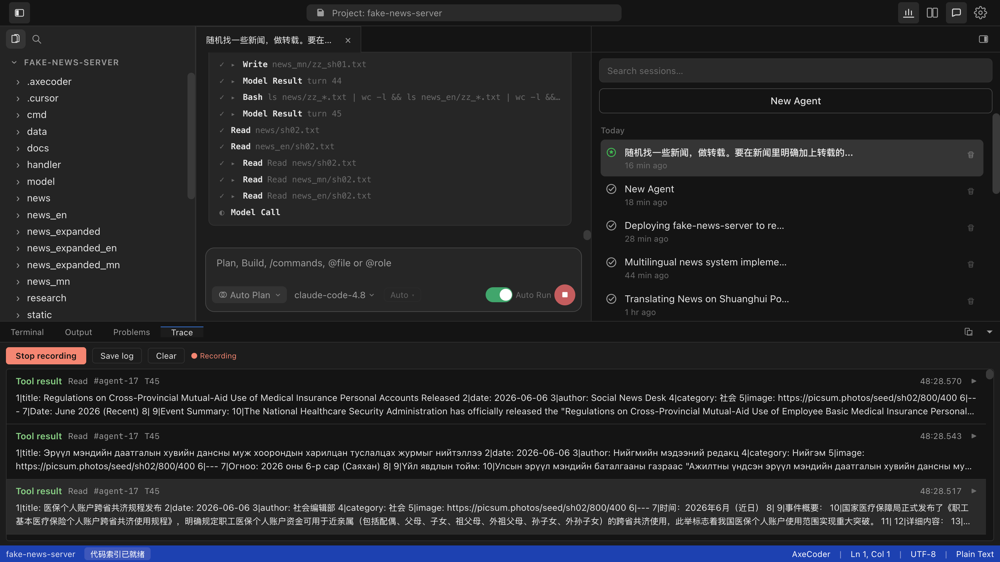
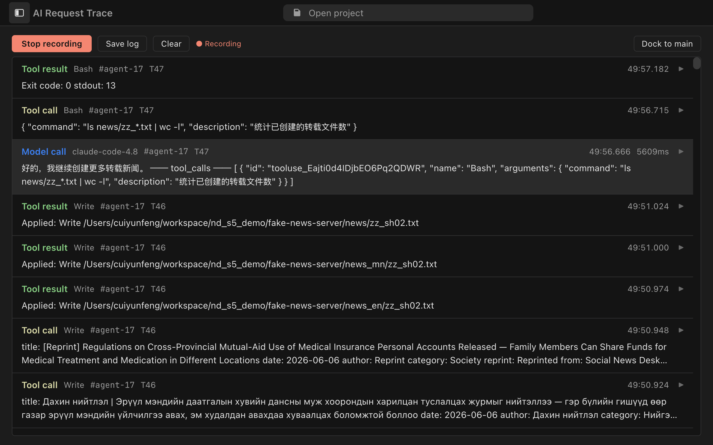
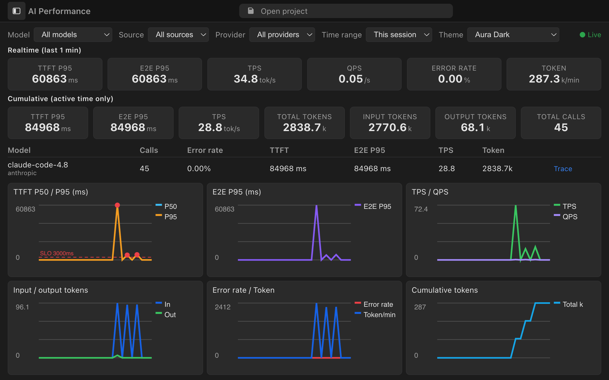

# AxeCoder

> Desktop IDE for coding — Electron + Vue 3 + Monaco, with a built-in AI Agent coding assistant

AxeCoder is a cross-platform desktop code editor built around a **Claude Code–style AI Agent**. Open a project, chat with the model, and let the Agent read/write files, run commands, search the codebase, and coordinate sub-agents — all from a VS Code–like workbench. Built-in **AI Performance** and **AI Request Trace** panels give you real-time visibility into latency, token usage, and every model/tool call.

## 📸 Screenshots

**Workbench & Agent session** — editor, file tree, unified session list, streaming tool cards, and bottom Trace tab in one layout. Supports Agent and Workshop (multi-role) sessions side by side.



**AI Request Trace** — record and replay the full Agent timeline: prompts, model replies, tool calls, and results. Dock in the bottom panel or pop out to a dedicated window; export logs as JSONL.



**AI Performance** — live dashboards for TTFT, E2E latency, TPS, QPS, error rate, and token throughput. Filter by model/provider/source; jump from a model row to its Trace entries.



## ✨ Key Features

### AI Agent

- **42 built-in tools** — Claude Code–aligned core set (Read / Edit / Write / Bash / Grep / Glob / Agent / Task …) plus extensions: WebSearch, WebFetch, LSP, MCP, Skills, Plan Mode, worktree helpers, and more
- **Multi-turn agent loop** — automatic tool use with permission prompts, checkpoints/rollback, context compaction, and loop-guard against runaway calls
- **Parallel sub-agents** — spawn `generalPurpose` / `explore` / `plan` sub-agents to research or execute in parallel
- **Workshop (multi-agent)** — role-based collaborative sessions with step progress and streaming output inside the chat panel
- **Plan Mode** — read-only analysis first, then implement after you approve the plan
- **Output styles** — Default, Explanatory, or Learning reply modes

### Code Intelligence

- **Native CodeGraph** — tree-sitter + SQLite code knowledge graph embedded in the main process; Agent tools `CodeGraphExplore` / `CodeGraphSearch` / `CodeGraphNode` for structural navigation without endless Grep+Read
- **LSP tool** — query language servers for definitions, references, diagnostics, and more
- **Monaco Editor** — syntax highlighting, Markdown edit/preview, diff view, document preview (Word/PDF)

### AI Observability

- **AI Performance monitor** — TitleBar chart icon opens the metrics tab; detachable window for a dedicated dashboard
- **AI Request Trace recorder** — TitleBar record button captures every chat/Agent request; inspect, filter, save, or clear traces
- **Metrics ↔ Trace linkage** — click a model in the performance table to jump to matching trace entries

### IDE & Workflow

- **Flexible layout** — resizable sidebar/editor/chat; **dual-window mode** pops the chat/session panel to a companion window (great on a second monitor)
- **Unified session list** — Agent and Workshop sessions in one sidebar; persistent history per project
- **File explorer & global search** — ripgrep-powered project search with replace
- **Integrated terminal** — xterm.js terminal in the bottom panel
- **Git integration** — SCM panel, status, and diffs; optional Git host settings
- **Command palette & Quick Open** — `Cmd+Shift+P` and `Cmd+P` style navigation
- **Slash commands** — built-in and project-level custom commands
- **i18n & themes** — English/Chinese UI; VS Code, Aura Light, and Aura Dark themes

### Extensibility

- **Multi-model** — OpenAI, Anthropic, Ollama, and custom endpoints; per-user model profiles
- **MCP protocol** — connect external tools and data sources via Model Context Protocol
- **Skills & Hooks** — custom Skills plus PreToolUse / PostToolUse / UserPromptSubmit hooks
- **Rules & permissions** — project/user rules, tool allow/deny lists, OS sandbox option, auto-apply writes toggle

## 🏗️ Tech Stack

| Layer       | Technology                              |
| ----------- | --------------------------------------- |
| Desktop     | Electron 29                             |
| Frontend    | Vue 3 + TypeScript                      |
| Build       | Vite 5 + vite-plugin-electron           |
| Editor      | Monaco Editor                           |
| Terminal    | xterm.js + node-pty                     |
| AI          | OpenAI / Anthropic / Ollama APIs        |
| CodeGraph   | tree-sitter + better-sqlite3 (in-process) |
| MCP         | @modelcontextprotocol/sdk               |
| Search      | @vscode/ripgrep                         |
| Storage     | electron-store                          |

## 📁 Project Structure

```
AxeCoder/
├── src/                              # Renderer (Vue 3 frontend)
│   ├── App.vue                       # Workbench shell & window roles
│   ├── components/workbench/
│   │   ├── ChatPane.vue              # Agent / Workshop chat
│   │   ├── AgentsPanel.vue           # Unified session sidebar
│   │   ├── WorkshopChatSection.vue   # Multi-agent workshop UI
│   │   ├── EditorPane.vue            # Monaco editor area
│   │   ├── AiMetricsPanel.vue        # AI Performance dashboard
│   │   ├── AiTracePanel.vue          # AI Request Trace recorder
│   │   ├── BottomPanel.vue           # Terminal, output, metrics, trace
│   │   ├── SettingsPanel.vue         # Settings (models, users, rules…)
│   │   └── ...
│   ├── composables/                  # useWorkbench, etc.
│   ├── slash-commands/               # Slash command system
│   └── i18n/                         # Localization
├── electron/main/
│   ├── agent/                        # Agent loop, tools, MCP, skills, hooks
│   ├── codegraph/                    # Vendored CodeGraph engine
│   ├── ai/                           # Providers & chat-with-tools
│   ├── ai-metrics-store.ts           # Performance metrics ring buffer
│   ├── ai-trace-store.ts             # Request trace recorder
│   └── …                             # fs/git/terminal/agent IPC
├── docs/assets/                      # README screenshots
└── package.json
```

## 🚀 Quick Start

### Requirements

- Node.js >= 18
- pnpm (recommended) or npm

### Install & Run

```bash
git clone https://github.com/axecoder-ai/axecoder.git
cd AxeCoder
pnpm install
pnpm dev
```

### Build

```bash
pnpm build
```

Build output goes to `release/`.

## 🎯 Usage

### Configure AI Models

1. Open **Settings → Models** (or the model button in the title bar)
2. Add a provider:
   - **OpenAI** — API endpoint + key + model (e.g. `gpt-4o`)
   - **Anthropic** — API key + model (e.g. `claude-sonnet-4-20250514`)
   - **Ollama** — local URL + model name
3. Pick the model in the chat composer; switch effort/mode as needed

### Use the AI Agent

1. Open a project folder (`Cmd+O`)
2. Type a task in the chat panel — e.g. refactor a file, find dead code, write tests
3. Approve file writes and shell commands (or enable **auto-apply** in Settings → General)
4. Use `/` for slash commands; `@` to reference files; spawn sub-agents for parallel work

### Workshop (Multi-Agent)

1. Create a **Workshop** session from the session list
2. Assign roles and run collaborative multi-step tasks with visible step progress
3. Workshop runs share the same chat column; switch between Agent and Workshop sessions anytime

### Monitor AI Calls

| Action | How |
| ------ | --- |
| Open **AI Performance** | TitleBar chart icon → bottom **Metrics** tab (or detach to its own window) |
| Open **AI Request Trace** | TitleBar record dot → bottom **Trace** tab; click **Start recording** before chatting |
| Save trace log | Stop recording → **Save log** (stored under app data `ai-traces/`) |
| Dual-window chat | TitleBar dual-window button → companion window for sessions only |

### Keyboard Shortcuts

| Shortcut               | Action              |
| ---------------------- | ------------------- |
| `Cmd/Ctrl + O`         | Open project        |
| `Cmd/Ctrl + Shift + O` | Open file           |
| `Cmd/Ctrl + N`         | New file            |
| `Cmd/Ctrl + S`         | Save file           |
| `Cmd/Ctrl + W`         | Close tab           |
| `Cmd/Ctrl + F`         | Find                |
| `Cmd/Ctrl + Shift + F` | Find in project     |
| `Cmd/Ctrl + Shift + P` | Command palette     |
| `Cmd/Ctrl + Shift + C` | Toggle AI panel     |
| `Cmd/Ctrl + \``         | Toggle terminal     |
| `Cmd/Ctrl + ,`         | Settings            |

### Agent Tools (highlights)

| Category | Tools |
| -------- | ----- |
| Files | `Read`, `Edit`, `Write`, `Glob`, `Grep`, `Delete`, `Move` |
| Shell & tasks | `Bash`, `TodoWrite`, `Task`*, `TaskCreate` / `Get` / `Update` / `List` |
| Agents | `Agent`, `AskUserQuestion`, `EnterPlanMode`, `ExitPlanMode` |
| Web | `WebSearch`, `WebFetch` |
| Code intelligence | `LSP`, `CodeGraphExplore`, `CodeGraphSearch`, `CodeGraphNode` |
| Extensions | `Skill`, `DiscoverSkills`, `CallMcpTool`, `McpAuth`, `ListMcpResources`, `ReadMcpResource`, `NotebookEdit`, `EnterWorktree`, `ExitWorktree`, … |

\*42 tools total — see `electron/main/agent/agent-types.ts` for the full list.

## ⚙️ Configuration

Open **Settings** (`Cmd+,`):

| Tab | What you can configure |
| --- | ---------------------- |
| **General** | Theme, locale, editor font/auto-save, agent auto-apply, OS sandbox, loop guard, max tool rounds, output style, Git host |
| **Models** | Provider endpoints, API keys, model tiers |
| **Users** | Multi-user profiles with per-user model access |
| **Permissions** | Tool allow/deny rules per project |
| **Rules, Skills, Subagents** | Project rules, custom skills, subagent definitions |

## 📄 License

MIT License — see [LICENSE](./LICENSE).
