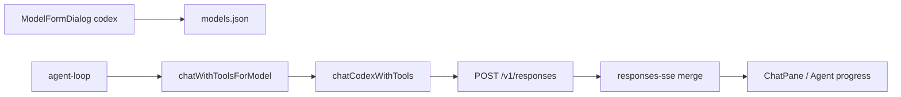

# Codex（Responses API）Provider 设计文档

> 依据：`docs/proposals/proposal-codex-provider.md`（**已确认**）  
> **范围：** 新增 `codex` Provider；Responses API plain chat + SSE + Agent tools；Settings UI；单测。  
> **约束：** Renderer 不直接 `fs`；密钥 Main 侧；不破坏现有三 Provider；V1 stateless。

## 变更范围、约束与时间线

| 项 | 说明 |
|----|------|
| **范围** | models-types、responses-messages/sse、providers/codex、chat-with-*、ai-ipc、agent-loop、ModelFormDialog、i18n、单测 |
| **不在范围** | WebSocket Responses、OAuth、vision wire、Codex CLI |
| **约束** | 最小 diff；复用 fetchAiWithRetry / metrics / trace |
| **时间线（估）** | 阶段一 1d wire → 阶段二 1d provider+tools → 阶段三 0.5d UI → 阶段四 0.5d 单测，合计 **约 3 人日** |

---

## 当前背景

- **系统：** AxeCoder Electron + Vue 3；Agent 经 `chatWithToolsForModel` 调用模型。
- **关键组件：**
  - `electron/main/models-types.ts:1` — 三 Provider 定义
  - `electron/main/ai/providers/openai.ts:15-18` — Chat Completions URL
  - `electron/main/ai/chat-with-tools.ts:317-342` — openai/ollama vs anthropic 分支
- **痛点：** Codex 模型需 Responses API；现有 openai Provider 不适用。

---

## 需求

### 功能需求

**P0**

- **P1 Provider 枚举：** `ModelProvider` 增加 `'codex'`。
- **P2 Plain chat：** `chatWithProvider` → `POST /v1/responses`，解析 `output` 文本与 reasoning。
- **P3 Agent tools：** `chatWithToolsForModel` → tools + function_call / function_call_output 闭环。
- **P4 流式：** SSE 事件 `response.output_text.delta`、`response.function_call_arguments.delta`、reasoning delta；Agent/聊天 UI 与 openai 同级。
- **P5 UI：** ModelFormDialog 增加 Codex；默认 URL；API Key 必填。
- **P6 单测：** wire、SSE、mock fetch tool 解析。

**P1**

- i18n 错误文案 `codexNeedsKey`
- models:ping 走 codex 分支

### 非功能需求

- 请求超时沿用 `AI_REQUEST_TIMEOUT_MS`
- 失败时不写半态配置
- 单测 `npm test` 全绿

---

## 设计决策

### 1. 独立 Provider 而非 wireApi 字段

- **选择：** 新增 `codex` Provider 值。
- **理由：** 已确认提案 1；UI 语义清晰。
- **不采用：** openai 内 wireApi 切换。

### 2. Stateless 全量 input

- **选择：** 每轮发送完整 `input[]`，`store: false`。
- **理由：** 与 Codex CLI 默认一致；无需 `previous_response_id` 状态机。

### 3. System → developer

- **选择：** Agent system 消息 wire 为 `role: developer`。
- **理由：** Codex / Responses 惯例；避免 `role: system` 兼容问题。

### 4. 流式复用 consumeOpenAiSse

- **选择：** Responses SSE 同为 `data: {...}` 行格式，复用 `consumeOpenAiSse` 解析器。
- **理由：** 减少重复代码；事件合并逻辑独立在 `responses-sse.ts`。

---

## 技术设计

### 1. 核心组件

```typescript
// electron/main/ai/providers/codex.ts
export const buildCodexResponsesUrl = (baseUrl: string): string
export const chatCodex = (...): Promise<AiChatResult>
export const chatCodexWithTools = (...): Promise<ChatWithToolsResult>
```

```typescript
// electron/main/ai/responses-messages.ts
export const agentLoopToResponsesInput = (messages: AgentLoopMessage[]): unknown[]
export const aiChatToResponsesInput = (messages: AiChatMessage[]): unknown[]
export const parseResponsesOutput = (output: unknown[] | undefined): ParsedResponsesOutput
```

### 2. 数据流



### 3. 文件变更（唯一改动集）

| 文件 | 类型 |
|------|------|
| `electron/main/models-types.ts` | 修改 |
| `electron/main/ai/responses-messages.ts` | 新增 |
| `electron/main/ai/responses-sse.ts` | 新增 |
| `electron/main/ai/providers/codex.ts` | 新增 |
| `electron/main/ai/parse-token-usage.ts` | 修改 |
| `electron/main/ai/chat-with-provider.ts` | 修改 |
| `electron/main/ai/chat-with-tools.ts` | 修改 |
| `electron/main/ai-ipc.ts` | 修改 |
| `electron/main/agent/agent-loop.ts` | 修改 |
| `electron/main/workshop/workshop-llm.ts` | 修改 |
| `src/types/axecoder.d.ts` | 修改 |
| `src/components/workbench/ModelFormDialog.vue` | 修改 |
| `src/components/workbench/ChatPane.vue` | 修改 |
| `shared/i18n/locales/en.ts` | 修改 |
| `shared/i18n/locales/zh-CN.ts` | 修改 |
| `tests/unittest/UT-codex-provider/*.test.ts` | 新增 |

---

## 实施计划

1. **阶段一：Wire + SSE 基础**
   - `responses-messages.ts`：agent/chat wire + output parse
   - `responses-sse.ts`：stream accum
   - 单测 wire/SSE

2. **阶段二：Provider 与分发**
   - `providers/codex.ts`：chat + tools
   - `chat-with-provider.ts` / `chat-with-tools.ts` 分支
   - `parseResponsesUsage`

3. **阶段三：流式与 UI**
   - ai-ipc、agent-loop、workshop-llm、ChatPane
   - ModelFormDialog、i18n、axecoder.d.ts

4. **阶段四：回归**
   - 全量 vitest
   - 更新 implement / review 报告

---

## 测试策略

| 类型 | 内容 |
|------|------|
| 单元 | URL 构建；system→developer；tool wire；SSE delta 合并 |
| 集成 mock | fetch mock 非流式/流式 function_call |
| 手工 | Settings 添加 codex → ping |

---

## 风险

| 风险 | 缓解 |
|------|------|
| Responses 事件类型变更 | adapter 隔离；单测 fixture |
| reasoning 项回传遗漏 | wire 测试覆盖 assistant+reasoning+tool |
| 用户误用 Chat 网关 | UI 文案 + codexNeedsKey |
