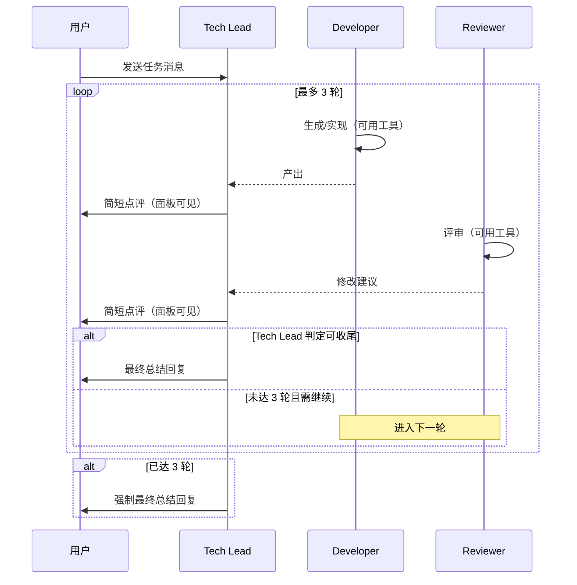

# PRD：Reflection 反思模式

| 字段 | 内容 |
|------|------|
| **文档版本** | v1.0 |
| **状态** | 已评审（需求澄清完成） |
| **创建日期** | 2026-06-11 |
| **负责人** | — |
| **关联需求** | [reflection-mode-requirements.md](../requirements/reflection-mode-requirements.md) |

---

## 1. 概述

### 1.1 产品摘要

在 AxeCoder 聊天模式中恢复并完善 **Reflection（反思）模式**：用户发送一条任务后，系统自动编排 **Developer** 与 **Reviewer** 进行 1～3 轮「实现 → 评审 → 改进」循环，**Tech Lead** 在每步之间穿插简短引导，并最终向用户交付总结性回复。

该模式借鉴吴恩达 Agent 设计模式中的 **Reflection**，将「生成 → 批评 → 改进」闭环产品化，提升单次请求下的代码质量与可审查性。

### 1.2 问题陈述

- `reflection` 聊天模式已在代码中存在，但因编排未完成而被隐藏（`DISABLED_CHAT_MODES`），用户无法使用。
- 当前 Agent 模式为单轮对话，缺少结构化的自我审查与迭代机制。
- Multi-Agent 模式支持自由协作，但流程不可控，不适合「固定反思循环」场景。

### 1.3 产品目标

| 目标 | 说明 |
|------|------|
| **恢复可用** | 在模式选择器中开放 Reflection，用户可一键选用 |
| **质量提升** | 通过 Developer↔Reviewer 多轮反馈，提高实现与评审质量 |
| **流程可控** | 固定编排顺序与轮次上限，避免协作发散 |
| **体验一致** | 复用 Workshop 多角色面板与现有内置角色，降低学习成本 |

### 1.4 成功指标

| 指标 | 目标 |
|------|------|
| 模式可见性 | Reflection 在模式选择器中可选，无隐藏/降级 |
| 编排完整性 | 单次用户消息可自动跑通完整 Reflection 流程并收尾 |
| 轮次合规 | Tech Lead 可在 1～3 轮内结束；不超过 3 轮硬上限 |
| 能力达标 | Developer 可改代码；Reviewer 可基于代码评审 |
| 模式隔离 | Reflection 与 Multi-Agent 互斥切换规则生效 |

---

## 2. 用户与场景

### 2.1 目标用户

- 使用 AxeCoder Agent 进行软件开发的工程师
- 希望 AI 在交付前自动完成「实现 + 代码评审」闭环的用户

### 2.2 用户故事

| ID | 角色 | 故事 | 优先级 |
|----|------|------|--------|
| US-01 | 开发者 | 作为开发者，我希望选择 Reflection 模式后发送任务，让 AI 自动实现并由 Reviewer 评审，以便减少低级错误 | P0 |
| US-02 | 开发者 | 作为开发者，我希望看到 Developer / Reviewer / Tech Lead 在 Workshop 面板中的分角色发言，以便理解迭代过程 | P0 |
| US-03 | 开发者 | 作为开发者，我希望 Tech Lead 在满意时提前结束循环，以便不必等待固定 3 轮 | P1 |
| US-04 | 开发者 | 作为开发者，我希望流程结束后由 Tech Lead 给出最终总结，以便快速把握结论 | P0 |
| US-05 | 开发者 | 作为开发者，我希望 Reflection 与 Multi-Agent 不会在同一会话中混用，以免编排冲突 | P1 |

### 2.3 典型使用场景

**场景 A：实现新功能并自动评审**

1. 用户在模式选择器中选择 Reflection
2. 系统打开 Workshop 多角色面板
3. 用户输入：「给 `utils/format.ts` 增加日期格式化函数并补单测」
4. Developer 实现代码 → Tech Lead 短评 → Reviewer 评审 → Tech Lead 短评
5. 若 Reviewer 发现问题，进入第 2 轮 Developer 修改
6. Tech Lead 判定可交付，输出最终总结

**场景 B：快速任务一轮收尾**

1. 用户发送简单重构任务
2. 第一轮 Reviewer 无重大问题
3. Tech Lead 在第 1 轮后即收尾，不进入后续轮次

---

## 3. 功能需求

### 3.1 模式入口（P0）

| 编号 | 需求 | 验收要点 |
|------|------|----------|
| FR-01 | 在左下角聊天模式选择器中展示 **Reflection** 选项 | 与 Agent、Multi-Agent 等并列可见 |
| FR-02 | 从 `DISABLED_CHAT_MODES` 移除 `reflection` | 可选、可存储、可加载 |
| FR-03 | 选中 Reflection 后自动关联并打开 Workshop 多角色面板 | 行为对齐 Multi-Agent 的 Workshop 绑定 |

### 3.2 参与角色（P0）

固定三个内置角色，定义如下：

| 角色 | 系统标识 | 工具能力 | 职责 |
|------|----------|----------|------|
| **Developer** | `builtin-developer` | 完整（含 `implement`） | 根据用户需求生成/修改实现，可改代码、跑命令 |
| **Reviewer** | `builtin-reviewer` | 完整（含 `code-review`） | 审查 Developer 产出，给出修改建议 |
| **Tech Lead** | `builtin-manager` | 无（纯文字） | 每步后简短点评/引导；判断是否继续；最终总结回复 |

### 3.3 编排流程（P0）

用户发送一条消息后，系统**自动**按固定顺序推进，**无需**用户逐步确认。

#### 单轮结构

```
Developer 生成/实现
  → Tech Lead 插话（简短点评）
  → Reviewer 修改建议/评审
  → Tech Lead 插话（简短点评）
```

#### 完整流程

```
用户消息
  → [第 1 轮] Developer → Tech Lead → Reviewer → Tech Lead
  → [若继续] [第 2 轮] Developer → Tech Lead → Reviewer → Tech Lead
  → [若继续] [第 3 轮] Developer → Tech Lead → Reviewer → Tech Lead
  → Tech Lead 最终回复（收尾）
```

#### 轮次规则

| 规则 | 说明 |
|------|------|
| 最少轮次 | 1 轮 |
| 最多轮次 | 3 轮（硬上限） |
| 继续条件 | 由 Tech Lead 自动判断：满意则提前收尾 |
| 强制收尾 | 第 3 轮结束后，Tech Lead 必须向用户做最终回复 |

### 3.4 展示与交互（P0）

| 编号 | 需求 | 验收要点 |
|------|------|----------|
| FR-04 | 中间过程在 Workshop 多角色面板按角色分气泡展示 | 与 Multi-Agent 展示一致 |
| FR-05 | 编排进行中展示各角色 thinking / speaking 状态 | 复用 `workshop:progress` |
| FR-06 | 流程完成以 Tech Lead 最终回复为信号 | 用户可明确感知结束 |
| FR-07 | 用户消息触发 Reflection 编排，不走普通单 Agent 循环 | 行为对齐 Multi-Agent 入口 |

### 3.5 模式切换（P1）

| 编号 | 需求 | 验收要点 |
|------|------|----------|
| FR-08 | Reflection 与 Multi-Agent **互斥锁定** | 会话有消息后，两者不可互相切换 |
| FR-09 | Reflection 可切回 Agent、Planning 等普通模式 | 沿用 `canPickChatMode` 扩展逻辑 |
| FR-10 | Multi-Agent 可切回 Agent 等普通模式 | 现有行为保持不变 |

---

## 4. 非功能需求

| 编号 | 类别 | 需求 |
|------|------|------|
| NFR-01 | 复用性 | 优先复用 Workshop 编排、内置角色（`builtin-workflow-roles`）、流式展示（`workshop-*` stream）、Multi-Agent 会话绑定 |
| NFR-02 | 可观测性 | Reflection 流程中各角色发言持久化到 Workshop 会话，支持回看 |
| NFR-03 | 一致性 | Reflection 与 Multi-Agent 在 UI、进度事件、流式展示上体验一致 |
| NFR-04 | 边界清晰 | Reflection 模式下主 Agent 工具循环不与 Workshop 编排并行抢答 |

---

## 5. 交互流程图



---

## 6. 范围界定

### 6.1 本期包含（In Scope）

- Reflection 模式 UI 开放与模式存储
- Developer / Reviewer / Tech Lead 固定编排
- 1～3 轮自动循环与 Tech Lead 收尾
- Workshop 面板展示与进度事件
- Reflection ↔ Multi-Agent 互斥锁定

### 6.2 本期不包含（Out of Scope）

| 项目 | 说明 |
|------|------|
| SwitchMode 工具支持 | `reflection` 是否纳入 `SWITCH_MODE_TARGETS` 待后续迭代 |
| 主聊天摘要同步 | 当前仅在 Workshop 面板展示全过程 |
| 中途取消编排 | 用户无法在流程进行中主动中止 |
| 与其他模式组合 | 如 Reflection + planning-only 的叠加行为 |
| 自定义角色参与 | 仅固定 Developer / Reviewer / Tech Lead |
| 轮次用户配置 | 轮次由 Tech Lead 自动判断，不提供 UI 手动设置 |

---

## 7. 依赖与假设

### 7.1 依赖

- 现有 Workshop 多角色面板与编排基础设施
- 内置角色：Developer、Reviewer、Tech Lead（`BUILTIN_WORKFLOW_ROLES`）
- Multi-Agent 的 Agent 会话 ↔ Workshop 绑定逻辑（`syncMultiAgentWorkshop` 同类能力）
- `workshop:progress` 与 `workshop-*` 流式通道

### 7.2 假设

- 用户已在设置中配置可用模型
- 用户已打开项目（`hasProject`）
- Developer / Reviewer 的工具权限与现有 Workshop Agent 发言能力一致

---

## 8. 风险与开放问题

| 类型 | 描述 | 缓解/待决 |
|------|------|-----------|
| 风险 | 3 轮循环导致 token 与耗时显著增加 | Tech Lead 支持提前收尾；硬上限 3 轮 |
| 风险 | Tech Lead 判断「是否继续」不稳定 | 编排层需明确 prompt/结构化输出约定 |
| 风险 | Reflection 与 Multi-Agent 逻辑分叉维护成本 | 最大化复用 Workshop 编排与 UI |
| 开放问题 | SwitchMode 是否支持 reflection | 本期不做，后续 PRD 补充 |
| 开放问题 | 主聊天是否显示 Tech Lead 最终回复摘要 | 本期不做 |

---

## 9. 验收标准

### 9.1 功能验收

- [ ] **AC-01** 模式选择器中可见并可选用 Reflection
- [ ] **AC-02** 选用 Reflection 后自动打开 Workshop 面板
- [ ] **AC-03** 发送用户消息后，按 Developer → Tech Lead → Reviewer → Tech Lead 顺序自动推进
- [ ] **AC-04** Tech Lead 可在第 1～3 轮内提前结束并给出最终回复
- [ ] **AC-05** 第 3 轮结束后 Tech Lead 强制收尾
- [ ] **AC-06** Developer 可实际修改代码、执行工具
- [ ] **AC-07** Reviewer 可读取代码并给出评审意见
- [ ] **AC-08** Tech Lead 插话为纯文字，不调用工具
- [ ] **AC-09** 各角色发言在 Workshop 面板分气泡展示，含 thinking/speaking 状态
- [ ] **AC-10** 会话有消息后，Reflection 与 Multi-Agent 不可互相切换
- [ ] **AC-11** Reflection 可切回 Agent 等普通模式
- [ ] **AC-12** Reflection 流程发言持久化，刷新后可回看

### 9.2 测试建议

| 用例 | 步骤 | 期望结果 |
|------|------|----------|
| TC-01 模式可见 | 打开模式选择器 | 出现 Reflection |
| TC-02 单轮收尾 | 发送简单任务，Reviewer 无重大问题 | 1 轮后 Tech Lead 收尾 |
| TC-03 多轮迭代 | 发送需修改的任务 | 2～3 轮 Developer↔Reviewer 循环 |
| TC-04 硬上限 | 构造 Reviewer 持续不满意场景 | 第 3 轮后强制收尾 |
| TC-05 互斥锁定 | Reflection 会话有消息后切 Multi-Agent | 切换被拒绝 |
| TC-06 工具能力 | 发送实现类任务 | Developer 产生文件变更；Reviewer 引用代码评审 |

---

## 10. 需求澄清记录

| 澄清项 | 结论 |
|--------|------|
| 入口 | 左下角聊天模式选择器 |
| 轮次控制 | Tech Lead 自动判断，最多 3 轮 |
| Tech Lead 插话 | 每步后简短文字点评/引导，不用工具 |
| Developer / Reviewer 能力 | 均可使用完整工具（改代码 / 评审） |
| UI 展示 | Workshop 多角色面板 |
| 模式锁定 | Reflection 与 Multi-Agent 互斥，可切回 Agent 等 |

---

## 11. 修订记录

| 版本 | 日期 | 作者 | 变更说明 |
|------|------|------|----------|
| v1.0 | 2026-06-11 | — | 初版：由需求澄清文档转化为标准 PRD |
