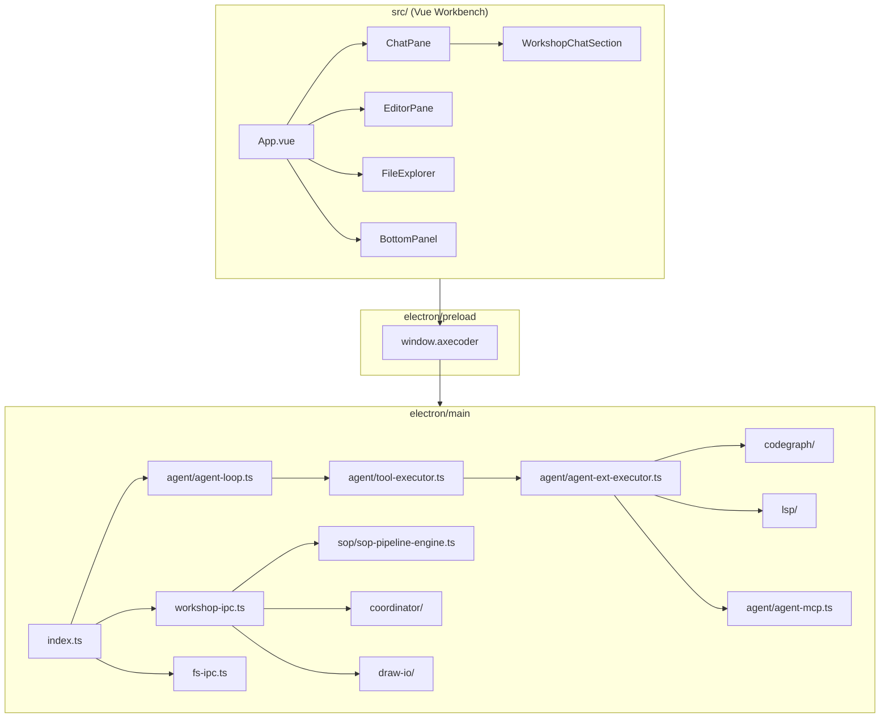

# AxeCoder 系统功能清单

> 调研日期：2026-06-29  
> 版本：0.9.5  
> 技术栈：Electron 29 + Vue 3 + Monaco + tree-sitter CodeGraph  
> **页面布局与每个按钮说明** → [页面布局与按钮.md](./页面布局与按钮.md)

---

## 统计概览

| 维度 | 数量 |
|------|------|
| **功能模块（一级）** | 9 |
| **功能点（细项）** | **约 180+** |
| **Agent 内置工具** | **57**（见 `electron/main/agent/agent-types.ts`） |
| **内置斜杠命令** | **11**（`resources/builtin-commands/`） |
| **内置 Skills** | **15**（`resources/builtin-skills/*/SKILL.md`） |
| **IPC 注册模块** | **21**（`electron/main/index.ts`） |
| **Workbench Vue 组件** | **60+**（`src/components/workbench/`） |
| **主进程 TypeScript 模块** | **230+**（`electron/main/`） |
| **单元测试目录** | **80+**（`tests/unittest/UT-*`） |

---

## 1. 项目顶层结构

| 目录 | 职责 | 关键入口文件 |
|------|------|-------------|
| `src/` | Vue 3 渲染进程（Workbench UI） | `src/App.vue` |
| `electron/main/` | Electron 主进程（Agent、FS、Git、LSP 等） | `electron/main/index.ts` |
| `electron/preload/` | 预加载脚本，暴露 `window.axecoder` API | `electron/preload/index.ts` |
| `extensions/axecoder/` | VS Code 扩展形态（Companion / Webview） | `extensions/axecoder/src/`、`out/` |
| `resources/` | 内置命令、Skills、LSP 示例配置 | `resources/builtin-commands/`、`builtin-skills/` |
| `shared/` | 跨进程共享类型与工具 | `shared/at-ref-parse.ts`、`shared/reasoning-effort.ts` |
| `packages/axecoder-core/` | 扩展与主进程共享核心类型 | `packages/axecoder-core/src/types/` |
| `skills/` | 项目级 Agent Skills（Cursor 风格） | `skills/*/SKILL.md` |
| `docs/` | 文档、调研、交付物 | `docs/deliverables/`、`docs/research/` |
| `tests/unittest/` | 按功能划分的单元测试 | `tests/unittest/UT-*/` |
| `.axecoder/` | 运行时项目数据（session、subagent 输出） | 运行时生成 |
| `.codegraph/` | CodeGraph 本地索引数据 | 运行时生成 |

**主进程启动与 IPC 总入口**：`electron/main/index.ts`（注册 21 个 IPC 模块，创建主窗口 / Companion / Metrics / Trace 独立窗口）

---

## 2. IDE 基础功能（35 项）

### 2.1 工作台壳层与布局（7 项）

| # | 功能 | 说明 | 实现文件 |
|---|------|------|----------|
| 1 | 工作台主壳 | 侧边栏 + 编辑器 + 聊天 + 底栏四区布局 | `src/App.vue` |
| 2 | 标题栏 | 模型选择、Trace 录制、Metrics、Companion、双窗口按钮 | `src/components/workbench/TitleBar.vue` |
| 3 | 活动栏 | 左侧图标切换（文件/搜索/Git/Agent 等） | `src/components/workbench/ActivityBar.vue` |
| 4 | 侧栏视图栏 | 侧栏顶部 Tab 切换 | `src/components/workbench/SidebarViewBar.vue` |
| 5 | 状态栏 | 行号、语言、诊断、Git 分支等 | `src/components/workbench/StatusBar.vue` |
| 6 | 欢迎页 | 未打开项目时的引导页 | `src/components/workbench/WelcomePage.vue` |
| 7 | 双窗口 / Companion | 聊天面板弹出到第二显示器独立窗口 | `electron/main/index.ts`（`createCompanionWindow`）、`src/utils/workbench-window-role.ts` |

**状态管理**：`src/composables/workbench-state.ts`、`src/composables/useWorkbench.ts`、`src/composables/useWorkbenchSession.ts`

### 2.2 文件与项目（12 项）

| # | 功能 | 说明 | 实现文件 |
|---|------|------|----------|
| 8 | 打开项目/文件夹 | 目录选择对话框、记住上次项目 | `electron/main/fs-ipc.ts`、`src/components/workbench/FileExplorer.vue` |
| 9 | 文件树 CRUD | 新建/重命名/删除/复制/移动 | `electron/main/fs-ipc.ts`、`FileExplorer.vue` |
| 10 | 读写文件 | UTF-8 读写、Base64 二进制 | `electron/main/fs-ipc.ts` |
| 11 | 自动保存 | 可配置延迟自动保存 | `electron/main/config-store.ts`、`src/App.vue` |
| 12 | 另存为 / 打开单文件 | Save As、Open File 对话框 | `electron/main/fs-ipc.ts` |
| 13 | 文件监听 | watchStart / watchStop 热更新 | `electron/main/fs-ipc.ts` |
| 14 | 最近文件/项目 | 历史记录列表 | `electron/main/fs-ipc.ts` |
| 15 | 在 Finder 中显示 | revealInFinder | `electron/main/fs-ipc.ts` |
| 16 | 隐藏路径过滤 | 过滤 `.git`、`node_modules` 等 | `src/utils/hidden-path.ts`、`electron/main/fs-utils.ts` |
| 17 | 文件图标 | 按扩展名显示 Material Icon | `src/components/workbench/FileIcon.vue`、`src/utils/fileIcon.ts` |
| 18 | Word/PDF 预览 | docx 转 HTML 内嵌预览 | `electron/main/fs-ipc.ts`、`src/components/workbench/DocumentPreviewPane.vue`、`src/utils/document-preview.ts` |
| 19 | Markdown 导出 | 导出 PDF / DOCX | `electron/main/markdown-export-ipc.ts` |

### 2.3 编辑器（8 项）

| # | 功能 | 说明 | 实现文件 |
|---|------|------|----------|
| 20 | Monaco 编辑器 | 语法高亮、主题、多语言 | `src/components/workbench/MonacoEditor.vue`、`src/monaco-setup.ts`、`src/utils/monaco-themes.ts` |
| 21 | 多标签编辑 | 打开/切换/关闭标签页 | `src/components/workbench/EditorPane.vue` |
| 22 | Markdown 编辑/预览 | 源码与预览双模式切换 | `EditorPane.vue` |
| 23 | Diff 视图 | Agent 改动审查、逐块 accept/reject | `EditorPane.vue`、`src/utils/patch-stats.ts`、`electron/main/agent/agent-review-diff.ts` |
| 24 | 面包屑导航 | 当前文件路径层级 | `src/components/workbench/EditorBreadcrumb.vue` |
| 25 | 语言检测 | 按文件路径推断 Monaco 语言 | `src/utils/editor-language.ts` |
| 26 | LSP 编辑器集成 | 补全、跳转定义、引用、诊断 | `src/composables/useMonacoLsp.ts`、`electron/main/lsp/lsp-editor-ipc.ts` |
| 27 | Markdown 大纲 | 标题层级大纲侧栏 | `src/utils/markdown-outline.ts` |

### 2.4 搜索与导航（3 项）

| # | 功能 | 说明 | 实现文件 |
|---|------|------|----------|
| 28 | 全局搜索（ripgrep） | 全文搜索、正则、替换 | `electron/main/search-utils.ts`、`electron/main/fs-ipc.ts`、`src/components/workbench/SearchPanel.vue` |
| 29 | Quick Open（⌘P） | 模糊快速打开文件 | `src/components/workbench/QuickOpenPalette.vue`、`src/utils/quick-open-fuzzy.ts` |
| 30 | 命令面板（⌘⇧P） | 命令注册与执行 | `src/components/workbench/CommandPalette.vue`、`src/utils/command-registry.ts` |

### 2.5 终端（2 项）

| # | 功能 | 说明 | 实现文件 |
|---|------|------|----------|
| 31 | 集成终端 | xterm.js + node-pty，多 Tab | `electron/main/terminal-ipc.ts`、`src/components/workbench/TerminalView.vue`、`src/utils/terminal-theme.ts` |
| 32 | Shell 检测 | 默认 shell、CLI 路径检测 | `electron/main/terminal-cli-detect.ts`、`electron/main/config-store.ts` |

### 2.6 Git / SCM（6 项）

| # | 功能 | 说明 | 实现文件 |
|---|------|------|----------|
| 33 | Git 状态/暂存/提交 | status、stage、unstage、commit | `electron/main/git-ipc.ts`、`src/components/workbench/ScmPanel.vue` |
| 34 | Diff / 丢弃 | 单文件 diff、discard changes | `electron/main/git-ipc.ts` |
| 35 | 分支操作 | checkout、create branch | `electron/main/git-ipc.ts` |
| 36 | Fetch / Pull / Push | 远程同步 | `electron/main/git-ipc.ts` |
| 37 | Stash | stash / pop | `electron/main/git-ipc.ts` |
| 38 | Git Forge 集成 | GitHub 等 PR 提示、OAuth | `electron/main/git-forge/detect-forge.ts`、`gh-auth.ts`、`forge-prompt.ts`、`git-operation-tracking.ts`、`src/components/workbench/GitForgeSettingsCard.vue` |

### 2.7 底栏与输出（3 项）

| # | 功能 | 说明 | 实现文件 |
|---|------|------|----------|
| 39 | 底栏多 Tab | Terminal / Output / Problems / Metrics / Trace | `src/components/workbench/BottomPanel.vue` |
| 40 | 输出通道 | 主进程日志输出到 Output 面板 | `electron/main/output-channel.ts`、`electron/main/output-ipc.ts` |
| 41 | Problems 面板 | LSP 诊断汇总展示 | `src/composables/useMonacoLsp.ts`、`BottomPanel.vue` |

### 2.8 主题与国际化（4 项）

| # | 功能 | 说明 | 实现文件 |
|---|------|------|----------|
| 42 | 主题切换 | VS Code / Aura Light / Aura Dark | `electron/main/theme-colors.ts`、`src/utils/apply-theme.ts` |
| 43 | 国际化（中/英） | UI 文案切换 | `src/i18n/index.ts`、`src/i18n/translate.ts`、`shared/i18n/`、`electron/main/i18n.ts` |
| 44 | 工作区设置 | `.axecoder/settings.json`、快捷键 | `electron/main/workspace-settings.ts` |
| 45 | 扩展面板（占位） | 内置功能列表展示，无插件市场 | `src/components/workbench/ExtensionsPanel.vue` |

---

## 3. AI Agent / Chat 功能（55 项）

### 3.1 核心循环（9 项）

| # | 功能 | 说明 | 实现文件 |
|---|------|------|----------|
| 46 | Agent 主循环 | 多轮 tool use、流式输出、pending 审批 | `electron/main/agent/agent-loop.ts` |
| 47 | Agent IPC | start/stop/confirm/rewind 等 | `electron/main/agent-ipc.ts` |
| 48 | 核心工具执行 | Read/Edit/Write/Glob/Grep/Bash/Task 等 | `electron/main/agent/tool-executor.ts` |
| 49 | 扩展工具执行 | LSP/MCP/CodeGraph/Web/Draw.IO 等 | `electron/main/agent/agent-ext-executor.ts` |
| 50 | 工具定义（核心 11 个） | Read~AskUserQuestion | `electron/main/agent/agent-tool-prompts.ts` |
| 51 | 工具定义（扩展 46 个） | TodoWrite~GetDiagram | `electron/main/agent/agent-tool-prompts-ext.ts` |
| 52 | 工具注册表 | 合并核心 + 扩展 | `electron/main/agent/agent-tool-registry.ts` |
| 53 | 工具别名 | Agent→Task 等名称规范化 | `electron/main/agent/agent-tool-aliases.ts` |
| 54 | 循环守卫 | 防无限 tool 调用、最大轮次 | `electron/main/agent/agent-loop-guard.ts` |
| 55 | 中止运行 | stop / abort 信号 | `electron/main/agent/agent-run-abort.ts` |

### 3.2 会话与存储（9 项）

| # | 功能 | 说明 | 实现文件 |
|---|------|------|----------|
| 56 | 内存 Session | 运行时 agent session 状态 | `electron/main/agent/agent-session-store.ts` |
| 57 | 持久化 Chat Session | 按项目存盘聊天记录 | `electron/main/chat-store.ts` |
| 58 | 统一 Session 列表 | Agent + Workshop 合并展示 | `electron/main/session/session-registry.ts`、`session/session-ipc.ts` |
| 59 | 会话自动标题 | LLM 生成会话标题 | `electron/main/session/session-title.ts` |
| 60 | 聊天分支 | fork / branch tree | `electron/main/chat-branch.ts` |
| 61 | 会话侧边栏 UI | 历史、新建、搜索、删除 | `src/components/workbench/AgentsPanel.vue`、`src/utils/agents-panel.ts` |
| 62 | 聊天主面板 | 流式消息、工具卡片、模式切换 | `src/components/workbench/ChatPane.vue` |
| 63 | 聊天输入框 | 发送、附件、@引用、模式选择 | `src/components/workbench/WorkbenchChatInput.vue` |
| 64 | 会话偏好持久化 | 模式/模型 per-session 记忆 | `src/utils/session-preferences.ts` |

### 3.3 Checkpoint / 回滚（3 项）

| # | 功能 | 说明 | 实现文件 |
|---|------|------|----------|
| 65 | Checkpoint 快照 | 文件修改前自动快照 | `electron/main/agent/agent-checkpoint.ts` |
| 66 | 回滚 Rewind | 恢复到指定 checkpoint | `agent-loop.ts`、`agent-ipc.ts` |
| 67 | 列出 Checkpoints | listCheckpoints IPC | `electron/main/agent-ipc.ts` |

### 3.4 子 Agent / 并行（6 项）

| # | 功能 | 说明 | 实现文件 |
|---|------|------|----------|
| 68 | Task / Agent 子代理 | generalPurpose / explore / shell / plan 等 | `electron/main/agent/agent-subagent.ts`、`agent-subagent-types.ts` |
| 69 | Coordinator 并行 | 多子任务并行/串行协调 | `electron/main/coordinator/coordinator-agent.ts`、`coordinator-turn-engine.ts` |
| 70 | 后台任务 | TaskOutput / TaskStop / ShellStdin | `electron/main/agent/agent-subagent-tasks.ts`、`agent-bash-tasks.ts` |
| 71 | 后台任务 UI | 卡片展示运行中子任务 | `src/components/workbench/BackgroundTaskCard.vue`、`src/utils/background-task-state.ts` |
| 72 | 子 Agent 存储 | subagent 元数据持久化 | `electron/main/agent/agent-subagent-store.ts` |
| 73 | 内置子 Agent 类型 | bugbot、security-review、git-commit 等 | `electron/main/agent/agent-types.ts`（`SubagentType`） |

### 3.5 模式与 Plan（6 项）

| # | 功能 | 说明 | 实现文件 |
|---|------|------|----------|
| 74 | Chat 模式 | agent / plan / multi-agent / software-company / draw-io | `electron/main/agent/chat-mode.ts`、`src/utils/chat-modes.ts` |
| 75 | Plan Mode | EnterPlanMode / ExitPlanMode / CreatePlan | `electron/main/agent/agent-create-plan.ts`、`src/components/workbench/ChatPlanCard.vue` |
| 76 | Auto Plan | 自动进入只读规划 | `electron/main/agent/agent-auto-plan.ts`、`agent-auto-plan-classifier.ts` |
| 77 | 模式选择器 UI | 聊天输入区模式切换 | `src/components/workbench/ChatModePickerDropdown.vue` |
| 78 | Plan Build 流程 | 用户点击 Build 后开始实现 | `src/utils/plan-built.ts`、`src/utils/plan-steps.ts` |
| 79 | SwitchMode 工具 | agent ↔ plan 运行时切换 | `agent-tool-prompts-ext.ts`、`agent-ext-executor.ts` |

### 3.6 权限与审批（7 项）

| # | 功能 | 说明 | 实现文件 |
|---|------|------|----------|
| 80 | Write 审批 | confirm / reject 文件写入 | `agent-loop.ts`、`src/components/workbench/ChatDiffCard.vue` |
| 81 | Bash 审批 | confirm / reject shell 命令 | `src/components/workbench/ChatBashCard.vue` |
| 82 | AskUserQuestion | 结构化多选提问 | `src/components/workbench/ChatAskUserCard.vue` |
| 83 | 权限规则引擎 | allow / ask / deny 三级 | `electron/main/agent/agent-permissions.ts`、`agent-permission-rules.ts`、`agent-execpolicy.ts` |
| 84 | 权限设置 IPC | 项目/全局 permissions.json | `electron/main/permissions-ipc.ts`、`project-permissions-store.ts` |
| 85 | 权限设置 UI | Permissions Tab | `src/components/workbench/PermissionsTab.vue` |
| 86 | OS 沙箱 | macOS seatbelt / Linux bwrap | `electron/main/agent/agent-sandbox.ts`、`agent-sandbox-seatbelt.ts`、`agent-sandbox-bwrap.ts` |

### 3.7 上下文与记忆（9 项）

| # | 功能 | 说明 | 实现文件 |
|---|------|------|----------|
| 87 | 上下文压缩 | 长对话 compact 摘要 | `electron/main/agent/agent-context-compact.ts`、`electron/main/chat-compact.ts` |
| 88 | Token 预算 | 上下文窗口预算控制 | `electron/main/agent/agent-token-budget.ts` |
| 89 | FRC 工具消息裁剪 | 保留最近 N 条 tool 结果 | `electron/main/agent/agent-frc.ts` |
| 90 | 上下文注入 | 系统提示动态拼装 | `electron/main/agent/agent-context-inject.ts` |
| 91 | @ 文件引用 | 聊天中 @ 引用文件/文件夹 | `electron/main/agent/agent-at-refs.ts`、`src/components/workbench/AtRefPicker.vue`、`shared/at-ref-parse.ts` |
| 92 | 项目记忆 | AGENTS.md / auto-memory | `electron/main/agent/agent-memory.ts` |
| 93 | Remember / Forget 工具 | 持久化/删除事实 | `agent-tool-prompts-ext.ts`、`agent-ext-executor.ts` |
| 94 | Scratchpad | 临时笔记工具 | `electron/main/agent/agent-scratchpad.ts` |
| 95 | Todo / Task 管理 | TodoWrite、TaskCreate/Get/Update/List | `electron/main/agent/agent-todo-store.ts` |

### 3.8 系统提示与风格（5 项）

| # | 功能 | 说明 | 实现文件 |
|---|------|------|----------|
| 96 | System Prompt 构建 | 角色、规则、工具说明拼装 | `electron/main/agent/agent-system-prompt.ts` |
| 97 | Output Styles | Default / Explanatory / Learning | `electron/main/agent/agent-output-styles.ts`、`agent-output-styles-custom.ts` |
| 98 | 角色 Persona | Workshop 角色人设注入 | `electron/main/agent/agent-role-persona.ts` |
| 99 | Thinking 检测 | 推理内容解析与展示 | `electron/main/agent/thinking-detector.ts`、`src/utils/thinking-parser.ts`、`src/components/workbench/ThinkingPanel.vue` |
| 100 | Effort 切换 | reasoning effort 档位 | `src/components/workbench/EffortSwitcher.vue`、`shared/reasoning-effort.ts`、`src/utils/chat-effort.ts` |

### 3.9 AI 提供方与对话（8 项）

| # | 功能 | 说明 | 实现文件 |
|---|------|------|----------|
| 101 | 多模型 Provider | OpenAI / Anthropic / Ollama / Codex | `electron/main/ai/providers/`、`provider-registry.ts` |
| 102 | Chat with Tools | 流式 SSE 多轮对话 | `electron/main/ai/chat-with-tools.ts`、`chat-with-provider.ts` |
| 103 | 模型解析/路由 | tier 路由、API model ID 双映射 | `electron/main/ai/model-resolve.ts`、`api-model-resolve.ts`、`prompt-tier-heuristic.ts` |
| 104 | 视觉/图片 | 聊天附图、粘贴图片 | `electron/main/ai/ai-message-images.ts`、`ai-vision-guard.ts`、`src/utils/chat-vision.ts`、`chat-image-paste.ts`、`src/composables/useChatAttachedImages.ts` |
| 105 | AI IPC | 通用 chat、@ref 解析 | `electron/main/ai-ipc.ts` |
| 106 | 重试/超时 | 524 重试、请求超时 | `electron/main/ai/ai-request-retry.ts`、`request-timeout.ts` |
| 107 | Token 用量解析 | 从 SSE 解析 usage | `electron/main/ai/parse-token-usage.ts` |
| 108 | Provider 适配器 | OpenAI / Anthropic / Ollama / Codex SSE 适配 | `electron/main/ai/adapters/` |

### 3.10 斜杠命令（5 项）

| # | 功能 | 说明 | 实现文件 |
|---|------|------|----------|
| 109 | 内置命令加载 | resources + 项目 `.cursor/commands` | `electron/main/agent/agent-builtin-commands.ts`、`agent-custom-commands.ts` |
| 110 | 斜杠命令解析/运行 | 前端注册与执行 | `src/slash-commands/`（`registry.ts`、`run.ts`、`parse.ts`、`builtin.ts`） |
| 111 | 斜杠选择器 UI | `/` 触发命令列表 | `src/components/workbench/SlashCommandPicker.vue` |
| 112 | 工作流内置斜杠 | clarify / research / implement 等 | `src/slash-commands/workflow-builtin.ts` |
| 113 | RPPIT 工作流 | 特殊 RPPIT 命令 | `electron/main/agent/rppit-axecoder-addon.ts`、`resources/builtin-commands/rppit.md` |

**内置斜杠命令文件**（`resources/builtin-commands/`）：

| 命令文件 | 用途 |
|----------|------|
| `clarify.md` | 澄清需求 |
| `research-codebase.md` | 代码库调研 |
| `implement.md` | 实现任务 |
| `code-review.md` | 代码审查 |
| `create-plan.md` / `make-plan.md` | 创建计划 |
| `create-proposals.md` / `make-proposals.md` | 创建提案 |
| `summary.md` | 总结 |
| `rppit.md` | RPPIT 工作流 |
| `design_doc_template.md` | 设计文档模板 |

### 3.11 Hooks（1 项）

| # | 功能 | 说明 | 实现文件 |
|---|------|------|----------|
| 114 | Agent Hooks | PreToolUse / PostToolUse / UserPromptSubmit | `electron/main/agent/agent-hooks.ts` |

### 3.12 进度与 UI 卡片（5 项）

| # | 功能 | 说明 | 实现文件 |
|---|------|------|----------|
| 115 | Agent 进度流 | 工具调用实时展示 | `electron/main/agent/agent-progress-emit.ts`、`agent-progress-detail.ts`、`src/components/workbench/AgentProgressStream.vue` |
| 116 | 本轮改动条 | turn changes review | `src/components/workbench/ChatTurnChangesBar.vue` |
| 117 | 完成提示音 | 可选任务完成音效 | `electron/main/completion-sound.ts`、`src/utils/play-completion-sound.ts` |
| 118 | TPS 底栏徽章 | 实时吞吐显示 | `src/components/workbench/FooterTpsBadge.vue` |
| 119 | Agent Spinner | 加载动画 | `src/components/workbench/AgentSpinnerGlyph.vue` |

---

## 4. Workshop 多 Agent 协作（18 项）

### 4.1 三种模式

| # | 功能 | 说明 | 实现文件 |
|---|------|------|----------|
| 120 | Multi-Agent 模式 | 角色轮询协作，Manager 路由 | `electron/main/coordinator/coordinator-turn-engine.ts`、`workshop/workshop-router.ts`、`workshop-subagent-speaker.ts` |
| 121 | Software Co. (SOP) | MetaGPT 式 PRD→设计→实现→QA | `electron/main/sop/sop-pipeline-engine.ts`、`sop-action-graph.ts`、`sop-task-runner.ts` |
| 122 | Draw.IO 模式 | AI 辅助绘图（嵌入 draw.io） | `electron/main/draw-io/`、`src/components/workbench/DrawIoEmbed.vue` |

### 4.2 Workshop 基础设施（10 项）

| # | 功能 | 说明 | 实现文件 |
|---|------|------|----------|
| 123 | Workshop IPC | 会话 CRUD、发消息、运行 | `electron/main/workshop-ipc.ts` |
| 124 | Workshop 存储 | 按项目持久化 | `electron/main/workshop/workshop-store.ts` |
| 125 | 类型定义 | 角色/阶段/消息结构 | `electron/main/workshop/workshop-types.ts` |
| 126 | 进度推送 | IPC 流式进度事件 | `electron/main/workshop/workshop-progress-emit.ts`、`workshop-stream.ts` |
| 127 | LLM 封装 | Workshop 专用模型调用 | `electron/main/workshop/workshop-llm.ts` |
| 128 | 用户绑定 | 角色 ↔ 用户映射 | `electron/main/workshop/workshop-user-bind.ts`、`workshop-user-skills.ts` |
| 129 | 内置工作流角色 | Tech Lead / Researcher 等 | `electron/main/builtin-workflow-roles.ts` |
| 130 | Workshop UI | 分屏聊天 + 工作区 | `src/components/workbench/WorkshopChatSection.vue`、`WorkshopPane.vue`、`WorkshopMessageItem.vue` |
| 131 | SOP 进度条 | 阶段/任务进度可视化 | `src/components/workbench/WorkshopSopProgress.vue` |
| 132 | 角色 @ 提及 | 多角色选择器 | `src/components/workbench/RoleMentionPicker.vue`、`src/utils/role-mention.ts` |

### 4.3 SOP 子模块（6 项）

| # | 功能 | 说明 | 实现文件 |
|---|------|------|----------|
| 133 | PRD/Design/Tasks Schema | 结构化产物定义 | `electron/main/sop/schemas/` |
| 134 | 意图分类 | 绿场/增量项目判断 | `electron/main/sop/sop-intent.ts` |
| 135 | 快速/逐任务模式 | SOP 执行策略 | `electron/main/sop/sop-mode.ts`、`sop-fast-pipeline.ts` |
| 136 | 测试跑测 | shell 执行测试反馈 | `electron/main/sop/sop-test-runner.ts` |
| 137 | 交付物写入 | `docs/deliverables/{slug}/` | `electron/main/sop/sop-artifact.ts` |
| 138 | QA 循环 | 失败回 Developer（最多 3 轮） | `electron/main/sop/qa-loop.ts`、`sop-gates.ts` |

**SOP 相关主进程文件一览**：

`electron/main/sop/sop-pipeline-engine.ts`、`sop-types.ts`、`sop-prompts.ts`、`sop-role-tools.ts`、`message-pool.ts`、`rppit-phase-map.ts`、`index.ts`

---

## 5. 代码智能（14 项）

### 5.1 LSP（8 项）

| # | 功能 | 说明 | 实现文件 |
|---|------|------|----------|
| 139 | LSP 服务管理 | 多语言 server 启动/停止 | `electron/main/lsp/lsp-manager.ts`、`lsp-server-manager.ts`、`lsp-server-instance.ts` |
| 140 | LSP 配置 | `lsp.json` 解析 | `electron/main/lsp/lsp-config.ts`、`resources/lsp.json.example` |
| 141 | 编辑器 LSP IPC | 补全/定义/引用/格式化 | `electron/main/lsp/lsp-editor-ipc.ts` |
| 142 | Agent LSP 工具 | operation 枚举查询 | `electron/main/agent/agent-lsp.ts`、`agent-lsp-prompt.ts`、`lsp/types.ts` |
| 143 | ReadLints 工具 | 读取诊断信息 | `electron/main/agent/agent-read-lints.ts` |
| 144 | FixLints 工具 | 自动修复 lint | `electron/main/agent/agent-fix-lints.ts` |
| 145 | Workspace Edit | 批量应用 LSP 编辑 | `electron/main/lsp/lsp-workspace-edit.ts` |
| 146 | 格式化 | 文档/范围格式化 | `electron/main/lsp/lsp-formatters.ts` |

### 5.2 CodeGraph（6 项）

| # | 功能 | 说明 | 实现文件 |
|---|------|------|----------|
| 147 | CodeGraph 引擎 | tree-sitter + SQLite 知识图 | `electron/main/codegraph/`（`manager.ts`、`bridge.ts`） |
| 148 | CodeGraph IPC | status / index / query | `electron/main/codegraph-ipc.ts` |
| 149 | CodeGraphExplore 工具 | 结构探索 | `electron/main/agent/agent-codegraph.ts`、`agent-codegraph-prompt.ts` |
| 150 | CodeGraphSearch 工具 | 语义/结构搜索 | 同上 |
| 151 | CodeGraphNode 工具 | 节点详情查询 | 同上 |
| 152 | 打开项目自动索引 | 后台建索引 | `codegraph-ipc.ts`（`maybeAutoIndexCodeGraph`） |

---

## 6. 设置与配置（22 项）

### 6.1 全局配置（4 项）

| # | 功能 | 说明 | 实现文件 |
|---|------|------|----------|
| 153 | 配置存储 | electron-store 持久化 | `electron/main/config-store.ts`、`settings-store.ts` |
| 154 | 密钥存储 | API Key 等敏感信息 | `electron/main/secrets-store.ts` |
| 155 | 数据迁移 | 旧版 AxeCoder 数据迁移 | `electron/main/migrate-axecoder.ts` |
| 156 | .axecoder 目录 | 项目级元数据目录 | `electron/main/axecoder-dir.ts`、`project-axecoder-dir.ts` |

### 6.2 设置 UI（2 项）

| # | 功能 | 说明 | 实现文件 |
|---|------|------|----------|
| 157 | 设置面板 | General / Models / Users / Rules / Permissions / MCP | `src/components/workbench/SettingsPanel.vue`、`SettingsModal.vue` |
| 158 | 通用设置 Tab | 主题、字体、自动保存、终端、Agent 开关 | `src/components/workbench/GeneralTab.vue` |

### 6.3 模型（4 项）

| # | 功能 | 说明 | 实现文件 |
|---|------|------|----------|
| 159 | 模型 CRUD | list / save / delete / toggle | `electron/main/models-store.ts`、`models-ipc.ts`、`models-types.ts` |
| 160 | 模型 Ping | 连通性测试 | `electron/main/models-ping.ts` |
| 161 | 模型 UI | 列表 / 表单 / 下拉选择 | `src/components/workbench/ModelsTab.vue`、`ModelFormDialog.vue`、`ModelPickerDropdown.vue` |
| 162 | 模型选择器（标题栏） | 快速切换当前模型 | `TitleBar.vue`、`ModelPickerDropdown.vue` |

### 6.4 用户 / 角色（4 项）

| # | 功能 | 说明 | 实现文件 |
|---|------|------|----------|
| 163 | 用户管理 | Workshop 角色用户 CRUD | `electron/main/users-store.ts`、`users-ipc.ts`、`users-types.ts` |
| 164 | 用户 UI | Users Tab | `src/components/workbench/UsersTab.vue`、`UserFormDialog.vue` |
| 165 | 头像 | 选取/显示用户头像 | `electron/main/profile-avatar.ts`、`SettingsProfileCard.vue` |
| 166 | 用户可用 Skills | 按用户过滤 skills | `electron/main/users-available-skills.ts` |

### 6.5 Rules（3 项）

| # | 功能 | 说明 | 实现文件 |
|---|------|------|----------|
| 167 | Rules CRUD | 项目/用户 rules | `electron/main/rules/rules-store.ts`、`rules-ipc.ts`、`rules-parse.ts` |
| 168 | Rules UI | Rules Tab + 表单 | `src/components/workbench/RulesSkillsTab.vue`、`RuleFormDialog.vue` |
| 169 | 第三方 Rules 导入 | Cursor 插件 rules 导入 | `rules-ipc.ts` |

### 6.6 Skills（3 项）

| # | 功能 | 说明 | 实现文件 |
|---|------|------|----------|
| 170 | Skills CRUD | 项目/用户 skills | `electron/main/skills/skills-store.ts`、`skills-ipc.ts`、`skills-parse.ts` |
| 171 | 内置 Skills | resources + skills/ 目录 | `electron/main/agent/agent-builtin-skills.ts`、`agent-skills.ts` |
| 172 | Skills UI | 表单对话框 | `src/components/workbench/SkillFormDialog.vue` |

**内置 Skills 目录**（`resources/builtin-skills/`）：

`brainstorming`、`dispatching-parallel-agents`、`executing-plans`、`finishing-a-development-branch`、`receiving-code-review`、`requesting-code-review`、`subagent-driven-development`、`systematic-debugging`、`test-driven-development`、`using-git-worktrees`、`using-superpowers`、`verification-before-completion`、`writing-plans`、`writing-skills`

### 6.7 MCP（2 项）

| # | 功能 | 说明 | 实现文件 |
|---|------|------|----------|
| 173 | MCP 运行时 | 连接/调用外部 MCP server | `electron/main/agent/agent-mcp.ts`、`agent-mcp-runtime.ts`、`agent-mcp-auth.ts` |
| 174 | MCP 插件管理 | Context7 等内置插件、OAuth | `electron/main/mcp-plugins-registry.ts`、`mcp-plugins-store.ts`、`mcp-plugins-ipc.ts`、`mcp-oauth-*.ts`、`src/components/workbench/McpPluginsTab.vue` |

---

## 7. AI 可观测性（6 项）

| # | 功能 | 说明 | 实现文件 |
|---|------|------|----------|
| 175 | AI Performance 指标 | TTFT / TPS / QPS / 错误率 / Token 吞吐 | `electron/main/ai-metrics-store.ts`、`ai-metrics-ipc.ts`、`src/components/workbench/AiMetricsPanel.vue` |
| 176 | AI Request Trace | 全链路录制、导出 JSONL | `electron/main/ai-trace-store.ts`、`ai-trace-ipc.ts`、`src/components/workbench/AiTracePanel.vue` |
| 177 | Metrics 独立窗口 | 弹出专用性能面板 | `electron/main/index.ts`（`metricsWin`） |
| 178 | Trace 独立窗口 | 弹出专用 Trace 面板 | `electron/main/index.ts`（`traceWin`） |
| 179 | Metrics ↔ Trace 联动 | 点击模型行跳转 Trace | `AiMetricsPanel.vue`、`AiTracePanel.vue` |
| 180 | 聊天进度路由 | 会话运行状态追踪 | `src/utils/chat-progress-route.ts`、`src/composables/useChatSessionRuns.ts` |

---

## 8. 扩展 / Companion（8 项）

| # | 功能 | 说明 | 实现文件 |
|---|------|------|----------|
| 181 | VS Code 扩展入口 | activate / deactivate | `extensions/axecoder/out/extension.js` |
| 182 | VS Code Host 适配 | 模拟 VS Code API | `extensions/axecoder/src/host/vscode-host.ts` |
| 183 | RPC 通道 | 主进程 ↔ Webview 通信 | `extensions/axecoder/src/rpc/channels.ts`、`registry.ts`、`webview-bridge.ts` |
| 184 | Chat Webview | 独立聊天视图 | `extensions/axecoder/webview/src/chat/ChatApp.vue` |
| 185 | Workshop Webview | Workshop 面板 | `extensions/axecoder/webview/src/workshop/WorkshopApp.vue` |
| 186 | Settings Webview | 设置视图 | `extensions/axecoder/webview/src/settings/SettingsApp.vue` |
| 187 | Metrics / Trace Webview | 性能与 Trace 面板 | `extensions/axecoder/webview/src/metrics/MetricsApp.vue`、`trace/TraceApp.vue` |
| 188 | Sessions Tree | 侧边栏会话树 | `extensions/axecoder/src/sessions-tree.ts` |

---

## 9. 其他功能（8 项）

| # | 功能 | 说明 | 实现文件 |
|---|------|------|----------|
| 189 | 多开 App 实例 | 启动新 AxeCoder 窗口 | `electron/main/launch-new-instance.ts` |
| 190 | 启动参数解析 | 命令行打开指定项目 | `electron/main/startup-args.ts` |
| 191 | 项目锁 | 防止多实例同时操作同一项目 | `electron/main/project-lock.ts` |
| 192 | Bash 执行策略 | 只读命令检测、arity 表 | `electron/main/agent/agent-bash-readonly.ts`、`agent-bash-arity-table.ts`、`agent-execpolicy-matcher.ts` |
| 193 | Git Worktree 工具 | EnterWorktree / ExitWorktree | `agent-tool-prompts-ext.ts`、`agent-ext-executor.ts` |
| 194 | Web 搜索/浏览 | WebSearch（Serper/Playwright）、WebFetch、WebRun | `electron/main/agent/agent-web.ts`、`agent-browser-playwright.ts` |
| 195 | Notebook 编辑 | Jupyter .ipynb 单元格编辑 | `electron/main/agent/agent-notebook.ts` |
| 196 | Preload API 桥接 | 暴露全量 `window.axecoder` | `electron/preload/index.ts`、`src/types/axecoder.d.ts` |

---

## 10. Agent 工具完整清单（57 个）

类型定义：`electron/main/agent/agent-types.ts`  
执行分发：`electron/main/agent/tool-executor.ts`（核心）、`agent-ext-executor.ts`（扩展）

### 10.1 核心工具（11 个）— `agent-tool-prompts.ts`

| 工具名 | 功能 | 执行文件 |
|--------|------|----------|
| Read | 读取文件内容 | `tool-executor.ts` |
| Edit | 精确字符串替换编辑 | `tool-executor.ts`、`edit-utils.ts` |
| Write | 写入/创建文件 | `tool-executor.ts` |
| Glob | 文件名模式匹配 | `tool-executor.ts`、`agent-fs.ts` |
| Grep | 内容搜索（ripgrep） | `tool-executor.ts` |
| Delete | 删除文件 | `tool-executor.ts` |
| Move | 移动/重命名文件 | `tool-executor.ts` |
| Bash | 执行 shell 命令 | `tool-executor.ts`、`agent-bash.ts` |
| Task | 启动子 Agent | `tool-executor.ts`、`agent-subagent.ts` |
| Agent | Task 别名，启动子 Agent | `tool-executor.ts`、`agent-tool-aliases.ts` |
| AskUserQuestion | 结构化向用户提问 | `tool-executor.ts` |

### 10.2 扩展工具（46 个）— `agent-tool-prompts-ext.ts`

| 工具名 | 功能 | 执行文件 |
|--------|------|----------|
| TodoWrite | 更新会话 Todo 列表 | `agent-ext-executor.ts`、`agent-todo-store.ts` |
| TaskCreate | 创建任务（Todo v2） | `agent-ext-executor.ts` |
| TaskGet | 获取任务详情 | `agent-ext-executor.ts` |
| TaskUpdate | 更新任务 | `agent-ext-executor.ts` |
| TaskList | 列出所有任务 | `agent-ext-executor.ts` |
| Coordinator | 并行协调多个子 Agent | `agent-ext-executor.ts`、`coordinator-agent.ts` |
| WebFetch | 抓取 URL 内容 | `agent-ext-executor.ts`、`agent-web.ts` |
| WebSearch | 网络搜索 | `agent-ext-executor.ts`、`agent-web.ts` |
| WebRun | Playwright 浏览器自动化 | `agent-ext-executor.ts`、`agent-browser-playwright.ts` |
| NotebookEdit | 编辑 Jupyter Notebook | `agent-ext-executor.ts`、`agent-notebook.ts` |
| EnterPlanMode | 进入 Plan 只读模式 | `agent-ext-executor.ts` |
| ExitPlanMode | 退出 Plan 模式 | `agent-ext-executor.ts` |
| SwitchMode | 切换 agent/plan 模式 | `agent-ext-executor.ts` |
| CreatePlan | 创建实现计划文档 | `agent-ext-executor.ts`、`agent-create-plan.ts` |
| Skill | 加载并执行 Skill | `agent-ext-executor.ts`、`agent-skills.ts` |
| DiscoverSkills | 发现可用 Skills | `agent-ext-executor.ts`、`agent-skills.ts` |
| DiscoverCommands | 发现可用斜杠命令 | `agent-ext-executor.ts`、`agent-slash-commands.ts` |
| SlashCommand | 执行斜杠命令 | `agent-ext-executor.ts`、`agent-slash-commands.ts` |
| CallMcpTool | 调用 MCP 工具 | `agent-ext-executor.ts`、`agent-mcp-runtime.ts` |
| McpAuth | MCP OAuth 认证 | `agent-ext-executor.ts`、`agent-mcp-auth.ts` |
| ListMcpResources | 列出 MCP 资源 | `agent-ext-executor.ts`、`agent-mcp-runtime.ts` |
| ReadMcpResource | 读取 MCP 资源 | `agent-ext-executor.ts`、`agent-mcp-runtime.ts` |
| TaskOutput | 获取后台任务输出 | `agent-ext-executor.ts`、`agent-subagent-tasks.ts` |
| ShellStdin | 向后台 shell 发送输入 | `agent-ext-executor.ts`、`agent-bash-tasks.ts` |
| TaskStop | 停止后台任务 | `agent-ext-executor.ts`、`agent-subagent-tasks.ts` |
| ToolSearch | 搜索可用工具 | `agent-ext-executor.ts` |
| LSP | 查询语言服务器 | `agent-ext-executor.ts`、`agent-lsp.ts` |
| ReadLints | 读取 lint 诊断 | `agent-ext-executor.ts`、`agent-read-lints.ts` |
| FixLints | 自动修复 lint | `agent-ext-executor.ts`、`agent-fix-lints.ts` |
| CodeGraphExplore | 探索代码图结构 | `agent-ext-executor.ts`、`agent-codegraph.ts` |
| CodeGraphSearch | 代码图搜索 | `agent-ext-executor.ts`、`agent-codegraph.ts` |
| CodeGraphNode | 代码图节点详情 | `agent-ext-executor.ts`、`agent-codegraph.ts` |
| EnterWorktree | 进入 Git worktree | `agent-ext-executor.ts` |
| ExitWorktree | 退出 Git worktree | `agent-ext-executor.ts` |
| Sleep | 等待（实验性） | `agent-ext-executor.ts` |
| Brief | 简要摘要（实验性） | `agent-ext-executor.ts` |
| Config | 读取配置（实验性） | `agent-ext-executor.ts` |
| Workflow | 工作流触发（实验性） | `agent-ext-executor.ts` |
| Remember | 持久化记忆 | `agent-ext-executor.ts`、`agent-memory.ts` |
| Forget | 删除记忆 | `agent-ext-executor.ts`、`agent-memory.ts` |
| DisplayDiagram | 显示 Draw.IO 图表 | `agent-ext-executor.ts`、`draw-io/` |
| EditDiagram | 编辑 Draw.IO 图表 | `agent-ext-executor.ts`、`draw-io/draw-io-xml.ts` |
| GetDiagram | 获取当前图表 XML | `agent-ext-executor.ts`、`draw-io/draw-io-store.ts` |

### 10.3 Agent 功能开关（`config-store.ts`）

| 配置项 | 控制工具/行为 |
|--------|--------------|
| `agentFeatureWebSearch` | WebSearch |
| `agentFeatureWebRun` | WebRun |
| `agentFeatureLsp` | LSP / ReadLints / FixLints |
| `agentFeatureCodeGraph` | CodeGraphExplore / Search / Node |
| `agentFeatureWorktree` | EnterWorktree / ExitWorktree |
| `agentFeatureSleep` / `Brief` / `Workflow` | 实验性工具 |
| `agentAutoApplyWrites` | 自动应用文件写入（跳过审批） |
| `agentOsSandboxEnabled` | OS 级沙箱 |
| `agentHooksEnabled` | Hooks 执行 |
| `agentAutoPlan` | 自动进入 Plan 模式 |

---

## 11. IPC 入口速查表（21 个）

| IPC 模块 | 注册文件 | 职责 |
|----------|----------|------|
| fs | `electron/main/fs-ipc.ts` | 文件系统、搜索、最近项目 |
| git | `electron/main/git-ipc.ts` | Git SCM 全套操作 |
| terminal | `electron/main/terminal-ipc.ts` | 集成终端 |
| lsp | `electron/main/lsp/lsp-editor-ipc.ts` | 编辑器 LSP |
| codegraph | `electron/main/codegraph-ipc.ts` | 代码图索引与查询 |
| chat | `electron/main/chat-store.ts` | Chat 会话持久化 |
| session | `electron/main/session/session-ipc.ts` | 统一会话列表 |
| agent | `electron/main/agent-ipc.ts` | Agent 运行与控制 |
| workshop | `electron/main/workshop-ipc.ts` | Workshop 协作 |
| draw-io | `electron/main/draw-io-ipc.ts` | Draw.IO 图表 |
| ai | `electron/main/ai-ipc.ts` | 通用 AI 调用 |
| models | `electron/main/models-ipc.ts` | 模型配置 |
| users | `electron/main/users-ipc.ts` | 用户/角色 |
| rules | `electron/main/rules/rules-ipc.ts` | Rules |
| skills | `electron/main/skills/skills-ipc.ts` | Skills |
| permissions | `electron/main/permissions-ipc.ts` | 权限规则 |
| mcpPlugins | `electron/main/mcp-plugins-ipc.ts` | MCP 插件 |
| aiMetrics | `electron/main/ai-metrics-ipc.ts` | 性能指标 |
| aiTrace | `electron/main/ai-trace-ipc.ts` | 请求追踪 |
| output | `electron/main/output-ipc.ts` | 输出通道 |
| markdownExport | `electron/main/markdown-export-ipc.ts` | MD 导出 PDF/DOCX |

另有 `workspace-settings.ts` 注册工作区设置 IPC。

---

## 12. 架构关系图

---

## 13. 快捷键一览

| 快捷键 | 功能 | 实现 |
|--------|------|------|
| ⌘/Ctrl + O | 打开项目 | `electron/main/index.ts`（菜单）、`fs-ipc.ts` |
| ⌘/Ctrl + Shift + O | 打开文件 | 同上 |
| ⌘/Ctrl + N | 新建文件 | `fs-ipc.ts` |
| ⌘/Ctrl + S | 保存 | `fs-ipc.ts`、`EditorPane.vue` |
| ⌘/Ctrl + W | 关闭标签 | `EditorPane.vue` |
| ⌘/Ctrl + F | 查找 | `MonacoEditor.vue` |
| ⌘/Ctrl + Shift + F | 项目内查找 | `SearchPanel.vue` |
| ⌘/Ctrl + Shift + P | 命令面板 | `CommandPalette.vue` |
| ⌘/Ctrl + Shift + C | 切换 AI 面板 | `App.vue` |
| ⌘/Ctrl + ` | 切换终端 | `BottomPanel.vue` |
| ⌘/Ctrl + , | 设置 | `SettingsPanel.vue` |

---

## 附录：功能点编号索引

| 模块 | 编号范围 | 数量 |
|------|----------|------|
| IDE 基础功能 | 1–45 | 45 |
| AI Agent / Chat | 46–119 | 74 |
| Workshop 协作 | 120–138 | 19 |
| 代码智能 | 139–152 | 14 |
| 设置与配置 | 153–174 | 22 |
| AI 可观测性 | 175–180 | 6 |
| 扩展 / Companion | 181–188 | 8 |
| 其他 | 189–196 | 8 |
| **合计（细项）** | | **196** |
| Agent 工具（独立统计） | | **57** |
