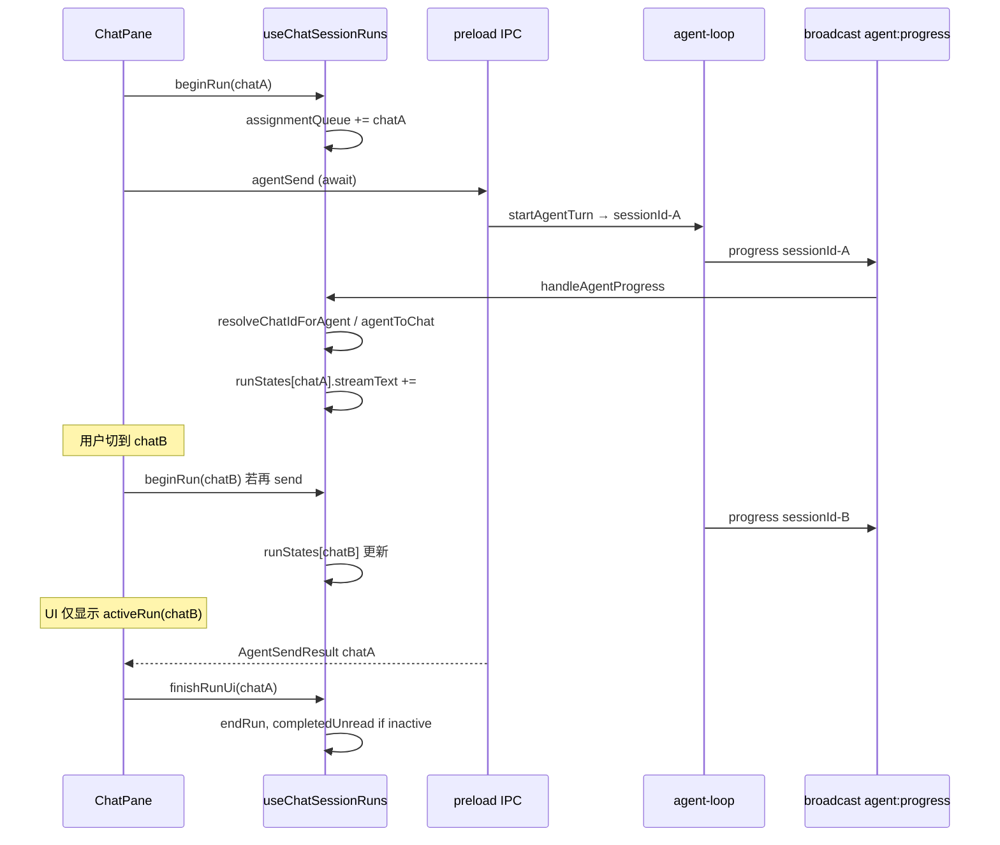

# AxeCoder 多会话 Chat / Agent 并发限制调研

**日期：** 2026-06-27  
**范围：** 前端 `ChatPane` / `useChatSessionRuns`、Electron `agent/` 主进程、Tab 指示与后台运行 UI  
**方法：** 静态代码阅读（事实记录，不含建议）

---

## 1. 核心发现摘要

AxeCoder **主进程侧**对多个 Agent 会话采用 `Map` 存储（`agent-session-store`），每次 `agent:send` 创建独立 `sessionId` 并异步执行 `runAgentLoopUntilDoneOrPending`；`agent:progress` 经 `broadcastToRenderers` 广播，payload 带 `sessionId`。**不存在**全局「单 Agent 锁」或显式并发上限。

**渲染进程侧**以「当前激活 Tab」为中心：`useChatSessionRuns` 虽为每个 `chatId` 维护 `runStates`，但暴露给 UI 的 `loading` / `streamText` / `progressSteps` 等均来自 `activeRun`（仅 `getActiveChatId()`）。`ChatPane` 对**同一 chat** 用 `isRunning(chatId)` 防重发；对**不同 chat** 无全局互斥——切换 Tab 后 `canSend` 仅看当前 Tab 的 `loading`，理论上可在 A 会话 IPC 未返回时于 B 再发。

**未形成「真并发」体验**的主要缺口（事实）：单例 `aiStreamUnsub`（plain SSE）、进度 UI 只绑激活 Tab、`tabDotFor` 已实现但未接入 Tab 模板、`assignmentQueue` 在双会话同时 `loading` 且无 `runningAgentSessionId` 时可能错绑 progress、`finishRunUi` 调用 `unbindAiStream()` 影响其他会话流、Stop 按钮只停当前 Tab 的 `runningAgentSessionId`。

---

## 2. ChatPane.vue

### 2.1 `aiStreamUnsub`

| 事实 | 位置 |
|------|------|
| 模块级单变量 `let aiStreamUnsub: (() => void) \| null = null` | `src/components/workbench/ChatPane.vue:428` |
| `unbindAiStream()` 取消订阅并置 `null` | `src/components/workbench/ChatPane.vue:1109-1112` |
| 仅在 `runPlainChat`（非 Agent、支持 SSE 的模型）内赋值：`onAiStream` 按 `streamId` 过滤后 `appendStreamText(chatId, …)` | `src/components/workbench/ChatPane.vue:1682-1689` |
| `finishRunUi` / `finishPendingRunUi` 均调用 `unbindAiStream()` | `src/components/workbench/ChatPane.vue:681-684`, `688-692` |
| `onUnmounted` 也调用 `unbindAiStream()` | `src/components/workbench/ChatPane.vue:2357-2360` |

**约束：** 同一时刻最多一个 plain-chat SSE 监听器；后发起的流或 `finishRunUi` 会拆掉前一个订阅。Agent 模式流式走 `onAgentProgress`，不经过 `aiStreamUnsub`。

### 2.2 `useChatSessionRuns` 接入

解构字段（未解构 `tabDotFor`）：

```456:478:src/components/workbench/ChatPane.vue
const {
  loading,
  pendingBusy,
  progressSteps,
  streamText,
  ...
  setupProgressListener,
  teardownProgressListener,
} = useChatSessionRuns({ ... })
```

- `onMounted` → `setupProgressListener()`（`src/components/workbench/ChatPane.vue:2333-2334`）
- `onUnmounted` → `teardownProgressListener()`（`2357-2358`）
- `getMessagesForChat`：激活 Tab 用 `activeSession`，否则 `sessionCache`（`480-482`）

### 2.3 `send()` 与运行守卫

| 路径 | 行为 | 位置 |
|------|------|------|
| Workshop 嵌入模式 | `loading.value \|\| workshopLoading.value` 则 return | `1785` |
| `!` shell | `isRunning(chatId)` 则提示等待 | `1853-1860` |
| `/` slash | `isRunning(chatId) \|\| hasPendingAgentInteraction()` 则拒绝 | `1886-1893` |
| 普通消息 | `isRunning(chatId)` 则 **静默 return**（无提示） | `1976` |
| 发送前 | `startRunUi` → `beginRun` | `2029-2033` |
| 发送后 | `finally` → `finishRunUi(chatId)` | `2090-2091` |

`canSend` 条件含 `!loading.value`（当前激活 Tab 的 loading）、`!workshopLoading.value`（`2095-2110`）。**未**检查其他 `chatId` 的 `isRunning`。

`send()` 对 `agentSend` / `aiChat` 使用 `await`；切换 Tab **不会**取消进行中的 Promise，后台 chat 仍会继续直至 `finishRunUi`。

### 2.4 `finishRunUi`

```681:686:src/components/workbench/ChatPane.vue
const finishRunUi = async (chatId: string, opts?: { skipTitleSuggest?: boolean }) => {
  stopIdleHintTimer()
  unbindAiStream()
  endRun(chatId, chatId !== activeId.value)
  await persistForChat(chatId, opts)
}
```

- `endRun` 在非激活 Tab 完成时设 `completedUnread = true`（经 `useChatSessionRuns.endRun`）
- `persistForChat` 可写非激活 `sessionCache`（`625-656`）

### 2.5 进度 UI（仅激活 Tab）

- `showProgressBubble = loading.value \|\| pendingBusy.value`（`2363`）——绑定 `activeRun`
- 模板 `:key="activeId"` 于 `chat-messages`（`2503`）；切换 Tab 重挂载消息区
- `AgentProgressStream` 使用 `progressSteps` / `streamText` / `subagentTaskList` 等全局 computed（`2715-2724`）
- `stopAgentRun` 使用 `runningAgentSessionId.value`（激活 Tab）（`1128-1136`）

### 2.6 Tab 条 UI

`unifiedOpenTabs` 渲染标题与关闭按钮（`2440-2457`）。**无** dot / badge / `tabDotFor` 引用。

`selectSession` 切换时 `clearUnread(id)`（`869`），不中断后台 run。

### 2.7 Pending / Continue 处理器

`onConfirmPending` 等一律 `const chatId = activeId.value`（如 `1264-1265`）。非激活 Tab 上的 pending 卡片在切换前无法通过同一 handlers 操作（handlers 绑定当前视图消息）。

---

## 3. useChatSessionRuns.ts

### 3.1 数据结构

| 符号 | 类型 / 作用 | 位置 |
|------|-------------|------|
| `runStates` | `reactive<Record<string, ChatSessionRunState>>`，按 chatId | `27`, `32-37` |
| `agentToChat` | `ref<Record<agentSessionId, chatId>>` | `28`, `57-62` |
| `assignmentQueue` | `ref<string[]>`，FIFO | `29`, `117-124`, `131` |
| `progressUnsub` | 单个 `onAgentProgress` 订阅 | `30`, `165-173` |

### 3.2 `activeRun` 与对外 computed

```41:55:src/composables/useChatSessionRuns.ts
const activeRun = computed(() => {
  const id = opts.getActiveChatId()
  return id ? ensureRunState(id) : createEmptyRunState()
})
const loading = computed(() => activeRun.value.loading)
// streamText, progressSteps, runningAgentSessionId, ... 同理
```

非激活 chat 的 `runStates[chatId].loading` 可仍为 `true`，但 UI 不读取。

### 3.3 `assignmentQueue` 与 `agentToChat`

**`beginRun`：** `loading=true`，若不在队列则 append `chatId`（`117-124`）。

**`resolveChatIdForAgent`：** 先查 `agentToChat[sessionId]`；否则在 `assignmentQueue` 中 `find` 第一个 `loading && !runningAgentSessionId` 的 chatId，并 `linkAgentSession`（`64-74`）。

**`handleAgentProgress`：** 解析 chatId 后 `applyProgressToChat`（`109-115`）。`payload.sessionId` 存在时会 `linkAgentSession`（`76-78`）。

**`endRun`：** `loading=false`，从 `assignmentQueue` 移除；可选 `completedUnread`；`resetRunProgress`（清空 `runningAgentSessionId` 等）（`127-136`）。**不**清理 `agentToChat` 条目。

**并发相关事实：** 若两个 chat 同时在 `assignmentQueue` 且均无 `runningAgentSessionId`，首个带 `sessionId` 的 progress 会把 **队列中第一个** loading chat 绑定，第二个 session 可能绑错 chat，直至后续 `linkAgentSession` 显式纠正。

### 3.4 `tabDotFor`

```158:159:src/composables/useChatSessionRuns.ts
const tabDotFor = (chatId: string, isActiveTab: boolean): ChatTabDotStatus | null =>
  deriveTabDotStatus(ensureRunState(chatId), opts.getMessagesForChat(chatId), isActiveTab)
```

已 export（`197`），**ChatPane 未 import/使用**。

---

## 4. chat-session-run-state.ts（Tab dot 逻辑）

```49:57:src/utils/chat-session-run-state.ts
export const deriveTabDotStatus = (...): ChatTabDotStatus | null => {
  if (run.loading || run.pendingBusy) return 'running'
  if (sessionHasPendingInteraction(messages)) return 'pending'
  if (run.completedUnread && !isActiveTab) return 'completed-unread'
  return null
}
```

类型：`'running' | 'pending' | 'completed-unread'`（`10`）。

单测覆盖优先级：`tests/unittest/UT-chat-session-run-state/chat-session-run-state.test.ts:23-39`。

---

## 5. electron/main/agent/（并行会话支持）

### 5.1 会话存储

```52:74:electron/main/agent/agent-session-store.ts
const sessions = new Map<string, StoredAgentSession>()
export const createSessionId = () => `agent-${Date.now()}-${sessionSeq++}`
export const putSession / getSession / deleteSession / listAgentSessions
```

多 session 并存；`listAgentSessions` 供 `agent:listSessions` IPC（`agent-ipc.ts:333-336`）。

### 5.2 回合生命周期

- `startAgentTurn`：新建 `sessionId`、`putSession`、`return runAgentLoopUntilDoneOrPending(...)`（`agent-loop.ts:794-921`）
- `runAgentLoopUntilDoneOrPending`：每轮 `bindAgentRunAbort(sessionId)`，循环至 `done` / `pending` / 错误（`356-361`）
- `finishDone`：成功结束时 **`deleteSession(sessionId)`**（`176-184`）
- `finishPending`：返回 `status: 'pending'` 且 **保留** session（`228-249`，不 delete）
- `stopAgentTurn`：按 `sessionId` 设 `abortRequested`、`abortAgentRun`、中断该 session 的 background runs 与 shell tasks（`342-354`）

### 5.3 中止控制器

`agent-run-abort.ts`：`controllersBySession` 为 **每 sessionId 一个** `AbortController`（`1-20`）。并行多 session 各有独立 signal。

### 5.4 进度广播

```4:6:electron/main/agent/agent-progress-emit.ts
export const emitAgentProgress = (payload) => {
  broadcastToRenderers('agent:progress', payload)
}
```

`renderer-broadcast.ts` 向所有 `BrowserWindow` 发送（`3-7`）。preload `onAgentProgress` 为 `ipcRenderer.on('agent:progress', …)`（`electron/preload/index.ts:647-651`）。

流式 token：`runModelStep` 内 `onDelta` → `emitAgentProgress({ sessionId, kind: 'content_delta' | 'thinking_delta', … })`（`agent-loop.ts:118-136`）。

### 5.5 后台子 Agent（会话内）

`agent-subagent-tasks.ts`：`runs = new Map<string, BackgroundSubAgentRun>()`（`28`）；`listBackgroundRuns(sessionId?)` 可按父 session 过滤（`69+`）。与 **跨 Chat Tab** 并发是不同层级：子任务挂在单个 agent session 上。

### 5.6 IPC 并发语义

`agent:send` 为 `ipcMain.handle` 异步 handler（`agent-ipc.ts:58-92`），每次调用独立 `startAgentTurn`。**代码中无**「已有运行则拒绝」的分支。

`ai-metrics-store` 的 `concurrent: active.size` 仅统计进行中的模型调用数（`478-480`），非业务层会话锁。

---

## 6. Tab dot / 后台运行 UI

| 组件 / 能力 | 状态 | 位置 |
|-------------|------|------|
| Tab 条 running / unread dot | **未接线**（`tabDotFor` 未用） | `ChatPane.vue:2440-2457` |
| `completedUnread` + `clearUnread` | 逻辑存在；切换 Tab 清除未读 | `useChatSessionRuns.ts:132-134,153-156`；`ChatPane selectSession:869` |
| `AgentProgressStream` 气泡 | 仅激活 Tab，`showProgressBubble` | `ChatPane.vue:2699-2726` |
| `BackgroundTaskCard` | 消息级子任务；独立 `onAgentProgress` 过滤 `kind==='subagent'` | `BackgroundTaskCard.vue:59-71`；`ChatPane` 消息模板 `2692-2696` |
| `subagentTaskList`（主进度条内） | 来自 `activeRun` | `useChatSessionRuns` + `ChatPane:2718` |
| Editor dirty dot | 与 chat 无关 | `EditorPane.vue:74` |
| AI Metrics `concurrent` | 监控面板显示并行模型调用数 | `AiMetricsPanel.vue` / `FooterTpsBadge.vue` |

---

## 7. 阻碍「真并发」的缺口（事实清单）

以下为**当前实现与真并发目标之间的差距**（仅陈述，无方案）：

1. **UI 单焦点：** 所有流式/进度 computed 源自 `activeRun`；后台 chat 的 `streamText`/`progressSteps` 更新但不显示，除非切回该 Tab。
2. **Plain chat 单 SSE 槽：** 全局 `aiStreamUnsub`；多 Tab plain 流或 `finishRunUi` 互拆订阅。
3. **发送门禁按 Tab 分裂：** 同 chat `isRunning` 阻塞；跨 chat 无全局阻塞，`canSend` 不看其他 chat 的 `runStates`。
4. **`assignmentQueue` 首匹配绑定：** 多 chat 同时 `beginRun` 且 progress 早于 `linkAgentSession` 时可能错路由。
5. **`agentToChat` 无淘汰：** `endRun` 不删除映射；长期运行可能残留 stale 条目（progress 仍可能命中旧 chatId）。
6. **Tab 视觉状态未实现：** `deriveTabDotStatus` / `tabDotFor` 已有，Tab UI 无 dot。
7. **Stop 仅当前 Tab：** `runningAgentSessionId` 来自 `activeRun`；后台 session 无 UI 停止入口（除非切 Tab）。
8. **`finishRunUi` 全局 `unbindAiStream`：** 结束任一 chat 会拆掉 plain SSE，即使另一 chat 仍在收流。
9. **消息区 `:key="activeId"`：** 切换 Tab 销毁/重建 DOM，不保留各 Tab 独立滚动/进度占位。
10. **Pending 交互与 `activeId`：** Confirm/Reject 等 handler 硬编码 `activeId.value`。
11. **主进程 session 在 `done` 后删除：** 完成后仅靠 chat 消息里的历史；并发完成顺序由 IPC 返回顺序决定，前端 `pushAssistantFromAgent` 写 `sessionCache`/active session。

---

## 8. 受影响文件

| 层级 | 文件 |
|------|------|
| UI 入口 | `src/components/workbench/ChatPane.vue` |
| 运行状态 | `src/composables/useChatSessionRuns.ts` |
| 状态模型 | `src/utils/chat-session-run-state.ts` |
| 子任务 UI | `src/components/workbench/BackgroundTaskCard.vue` |
| 进度组件 | `src/components/workbench/AgentProgressStream.vue`（由 ChatPane 引用） |
| IPC 桥 | `electron/preload/index.ts` |
| Agent IPC | `electron/main/agent-ipc.ts` |
| Agent 核心 | `electron/main/agent/agent-loop.ts` |
| Session 存储 | `electron/main/agent/agent-session-store.ts` |
| 中止 | `electron/main/agent/agent-run-abort.ts` |
| 进度 | `electron/main/agent/agent-progress-emit.ts`, `electron/main/renderer-broadcast.ts` |
| 后台子 Agent | `electron/main/agent/agent-subagent-tasks.ts` |
| Plain SSE | `electron/main/ai-stream-emit.ts` |
| 单测 | `tests/unittest/UT-chat-session-run-state/chat-session-run-state.test.ts` |
| 类型 | `src/types/axecoder.d.ts`（`onAiStream`, `onAgentProgress`, `AgentSendResult`） |

---

## 9. 跨组件数据流（并发相关）



**Plain chat 路径：** `runPlainChat` → `onAiStream(streamId)` → `appendStreamText(chatId)`；与 `agent:progress` 路径独立。

---

## 10. 约束汇总

| 约束 | 来源 |
|------|------|
| 单 chat 同时一条 outbound 用户消息流（`isRunning(chatId)`） | `ChatPane.send` |
| 单 ChatPane 实例单 `onAgentProgress` 订阅 | `useChatSessionRuns.setupProgressListener` |
| 单 plain SSE 监听器 | `ChatPane.aiStreamUnsub` |
| 进度展示绑定激活 `chatId` | `useChatSessionRuns.activeRun` |
| 主进程多 `StoredAgentSession` 可并存至 done/pending | `agent-session-store` + `agent-loop` |
| Progress 路由依赖 `sessionId` ↔ `chatId` 映射 + `assignmentQueue` 启发式 | `useChatSessionRuns` |
| Tab 无运行状态视觉反馈 | `tabDotFor` 未接入模板 |
| Workshop 模式独立 `workshopLoading` 门禁 | `ChatPane.send` / `canSend` |

---

*调研完成：基于仓库当前工作区代码，未运行应用验证。*
