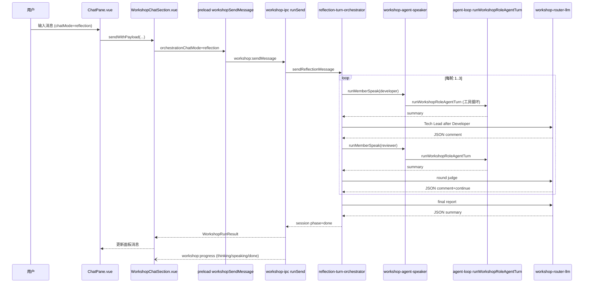

# Reflection 反思模式 — 代码库现状调研

| 字段 | 内容 |
|------|------|
| **调研日期** | 2026-06-12 |
| **调研范围** | Reflection 聊天模式在 AxeCoder 中的类型定义、UI 入口、编排逻辑、IPC 通道、Workshop 嵌入、模式锁定、单测 |
| **关联 PRD** | `docs/prd/reflection-mode-prd.md` |
| **交付记录** | `docs/deliverables/reflection-mode/reflection-mode-交付总结.md`（标注 2026-06-11 完成） |

---

## 1. 核心发现摘要

1. **`reflection` 已是合法 `ChatModeId`**，在前端 `CHAT_MODE_OPTIONS` 与主进程 `VALID` 集合中均注册；**当前未被 `DISABLED_CHAT_MODES` 隐藏**（仅 `planning-only` 被禁用）。
2. **独立编排器** `electron/main/workshop/reflection-turn-orchestrator.ts` 实现固定流程：每轮 Developer → Tech Lead 短评 → Reviewer → Tech Lead 轮次判定，最多 `REFLECTION_MAX_ROUNDS = 3` 轮，最后 Tech Lead 最终总结。
3. **用户消息不走主 Agent 循环**：Reflection / Multi-Agent 嵌入时，`ChatPane.send()` 将消息转发至 `WorkshopChatSection.sendWithPayload()`，经 IPC `workshop:sendMessage` 且 `orchestrationChatMode === 'reflection'` 时调用 `sendReflectionMessage`。
4. **Developer / Reviewer 使用完整 Agent 工具**（`buildAgentRoleSpeaker` → `runWorkshopRoleAgentTurn`，`workshopAutoApply: true`）；**Tech Lead 使用纯 LLM 文字**（`buildWorkshopRouterLlm` / `buildReflectionJudgeLlm`，无工具调用）。
5. **Workshop 与 Agent 会话 1:1 绑定**：`workshopIdForAgentChat(agentChatId)` → `ma-{agentChatId}`；选中 Reflection 后 `syncMultiAgentWorkshop()` 自动 `openForAgentChat`。
6. **模式互斥锁定** 由 `canPickChatMode` 实现：有消息后 Reflection ↔ Multi-Agent 不可互切，也不可从普通模式切入 Reflection。
7. **`SwitchMode` 工具不支持 `reflection`**：`SWITCH_MODE_TARGETS` 不含 reflection，`resolveSwitchModeTarget('reflection')` 返回 `null`。
8. **i18n 中无 Reflection 专用文案**；UI 标签来自 `CHAT_MODE_OPTIONS` 英文字符串。

---

## 2. 模式类型与存储

### 2.1 前端 `src/utils/chat-modes.ts`

- `ChatModeId` 联合类型包含 `'reflection'`（`src/utils/chat-modes.ts:1-9`）。
- `CHAT_MODE_OPTIONS` 第二项为 Reflection，描述为 Developer↔Reviewer 1–3 轮 Workshop 面板协作（`src/utils/chat-modes.ts:24-29`）。
- `DISABLED_CHAT_MODES = new Set(['planning-only'])`，**不含 reflection**（`src/utils/chat-modes.ts:49-50`）。
- `isWorkshopEmbeddedChatMode(id)` 对 `multi-agent` 与 `reflection` 均返回 true（`src/utils/chat-modes.ts:52-53`）。
- `canPickChatMode` 锁定逻辑（`src/utils/chat-modes.ts:97-109`）：
  - 有消息时，若 current 与 next 均为嵌入 Workshop 模式 → 禁止切换；
  - 有消息时，若 next 为嵌入 Workshop 模式 → 禁止切入；
  - 其余情况允许（含从 reflection 切回 agent）。

### 2.2 主进程 `electron/main/agent/chat-mode.ts`

- `ChatModeId` 同样包含 `'reflection'`（`electron/main/agent/chat-mode.ts:7-15`）。
- 主进程 `DISABLED` 集合仅含 `planning-only`（`electron/main/agent/chat-mode.ts:19`）。
- `chatModeSystemAddon('reflection')` 注入系统提示：协作在 Workshop 面板、1–3 轮反思循环、勿用 Task/Agent 工具（`electron/main/agent/chat-mode.ts:57-58`）。
- `applyChatModeEffects` 对 reflection 与 agent 一样关闭 `planMode`（`electron/main/agent/chat-mode.ts:96-98`）。
- `SWITCH_MODE_TARGETS` 仅 `agent | plan | planning | auto-plan`，**不含 reflection / multi-agent**（`electron/main/agent/chat-mode.ts:81`）。

### 2.3 类型声明 `src/types/axecoder.d.ts`

- `ChatModeId` 含 `'reflection'`（约第 117 行）。
- `workshopSendMessage` API 接受可选 `orchestrationChatMode?: string`（约第 1208-1216 行）。

### 2.4 持久化

- 全局默认模式存于 `localStorage` 键 `axecoder.chatMode`（`src/utils/chat-modes.ts:57-95`）。
- **Per-session `chatMode` 字段**：Reflection 模式下前端 `chatModeId` 为 ref，不写入 Agent 会话 JSON；实际对话内容存于绑定的 Workshop 会话文件。

---

## 3. UI 入口与 Workshop 嵌入

### 3.1 模式选择器 `src/components/workbench/ChatModePickerDropdown.vue`

- 遍历 `CHAT_MODE_OPTIONS` 渲染列表（`ChatModePickerDropdown.vue:96`）。
- Reflection 有独立 SVG 图标分支（`ChatModePickerDropdown.vue:127`、`198`）。
- 禁用态由 `canPickChatMode(activeModeId, id, hasSessionMessages)` 决定（`ChatModePickerDropdown.vue:48-49`）。

### 3.2 ChatPane 嵌入逻辑 `src/components/workbench/ChatPane.vue`

| 计算属性 / 函数 | 行为 | 行号 |
|----------------|------|------|
| `isWorkshopEmbeddedInAgentChat` | `chatModeId` 为 `multi-agent` 或 `reflection` 时为 true | 155-159 |
| `showWorkshopPanel` | Workshop 模式或嵌入时为 true | 160-162 |
| `showAgentComposer` | 嵌入时仍显示底栏输入框 | 163-165 |
| `syncMultiAgentWorkshop` | 调用 `workshopSectionRef.openForAgentChat(activeId)` | 284-292 |
| `embeddedWorkshopTitlePlaceholder` | reflection → `'Reflection'`，否则 `'Multi-Agent'` | 294-295 |
| `hasSessionMessagesForModeLock` | Agent 消息或 Workshop 消息数 > 0 即锁定 | 444-452 |
| `onChatModePick` | 选 reflection 时触发 `syncMultiAgentWorkshop` | 454-464 |
| `send()` | 嵌入时走 `workshopSectionRef.sendWithPayload`，不走 `agentSend` | 1645-1696 |

- `WorkshopChatSection` 接收 `:orchestration-chat-mode="chatModeId"`（`ChatPane.vue:2358`）。
- `onMounted` 若当前为 reflection/multi-agent 则 `syncMultiAgentWorkshop()`（`ChatPane.vue:2213-2215`）。

### 3.3 WorkshopChatSection `src/components/workbench/WorkshopChatSection.vue`

- `embeddedDefaultTitle`：reflection → `'Reflection'`（`WorkshopChatSection.vue:64-66`）。
- `sendPayload` 将 `props.orchestrationChatMode` 传入 `sendWorkshop`（`WorkshopChatSection.vue:526-534`）。
- `openForAgentChat`：按 `workshopIdForAgentChat` 加载或创建 Workshop 会话，新会话 title 为 `embeddedDefaultTitle`（`WorkshopChatSection.vue:636-666`）。
- `onWorkshopProgress` 监听 `workshop:progress`，更新 thinking/speaking/done 状态（`WorkshopChatSection.vue:705-742`）。

### 3.4 Agent ↔ Workshop 绑定 `src/utils/workshop-agent-link.ts`

```typescript
workshopIdForAgentChat(agentChatId) => `ma-${agentChatId}`
isAgentLinkedWorkshopId(workshopId) => workshopId.startsWith('ma-')
```

（`src/utils/workshop-agent-link.ts:1-9`）

---

## 4. 编排器实现

### 4.1 文件 `electron/main/workshop/reflection-turn-orchestrator.ts`

**常量与类型**

- `REFLECTION_MAX_ROUNDS = 3`（第 17 行）。
- `ReflectionJudgeLLM`、`ReflectionRoundJudge`、`parseReflectionRoundJudge`、`parseReflectionComment`（第 19-60 行）。

**角色查找**

- `findBuiltinUser(users, 'developer' | 'reviewer' | 'manager')`（第 62-63、171-173 行）。
- 三者缺一返回错误 `'Reflection requires builtin Developer, Reviewer, and Tech Lead users'`（第 175-177 行）。

**单轮成员发言 `runMemberSpeak`**

- 设置 `session.phase = 'running'`；
- `onProgress(roleId, 'thinking'|'speaking'|'done')`；
- 调用 `speaker(inp)`（即 `buildAgentRoleSpeaker` 产出的 `RoleSpeaker`）；
- 将 `summary` 写入 `session.messages`（第 81-109 行）。

**Tech Lead 纯文字 `runTechLeadText`**

- 调用 `judgeLlm(prompt)`，解析 JSON `comment`，push `roleId: 'manager'` 消息（第 111-125 行）。
- `buildReflectionJudgeLlm` 复用 `buildWorkshopRouterLlm`（第 127-128 行）。

**主流程 `sendReflectionMessage`（第 151-259 行）**

```
用户消息 push (roleId: user)
for round = 1..3 while shouldContinue:
  runMemberSpeak(developer)
  runTechLeadText(after Developer 短评)
  runMemberSpeak(reviewer)
  judgeLlm(round judge) → parseReflectionRoundJudge
  shouldContinue = !isLastRound && judged.continue
  pushMessage(manager, judged.comment)
judgeLlm(final report) → pushMessage(manager, finalText)
session.phase = 'done'
```

- 最后一轮强制 `continue: false` 的 prompt 文案（第 224-226 行）。
- 循环结束后额外一次 Tech Lead `final report`（第 239-254 行）。

### 4.2 与 Multi-Agent 编排对比

| 维度 | Multi-Agent | Reflection |
|------|-------------|------------|
| 编排入口 | `sendWorkshopMessage`（`coordinator-turn-engine`） | `sendReflectionMessage` |
| 路由 | `scriptedRouterLlm` / Coordinator LLM 动态指派 | 固定 Dev→TL→Rev→TL 顺序 |
| Tech Lead | 可作为 Coordinator 路由或 `manager_chat` | 仅 `judgeLlm` 纯文字 |
| IPC 分支 | `orchestrationChatMode !== 'reflection'` | `=== 'reflection'` |

Multi-Agent 编排由 `electron/main/workshop/workshop-turn-orchestrator.ts` 再导出 coordinator 引擎（第 1-7 行）。

---

## 5. IPC 与 Preload 通道

### 5.1 `electron/main/workshop-ipc.ts`

- `runSend` 根据 `orchestrationChatMode === 'reflection'` 分支（第 126-136 行）：
  - reflection → `sendReflectionMessage(..., buildReflectionJudgeLlm(...), onProgress, sendOptions)`
  - 否则 → `sendWorkshopMessage(..., routerLlm, ...)`
- `onProgress` 在 `status === 'done'` 时增量 `saveWorkshopSession`（第 114-124 行）。
- 终态再次 `saveWorkshopSession`（第 138-141 行）。
- `emitWorkshopProgress` 经 `workshop-progress-emit.ts` 广播 `workshop:progress`（`electron/main/workshop/workshop-progress-emit.ts:4-6`）。

### 5.2 `electron/preload/index.ts`

- `workshopSendMessage` 第 8 参数为 `orchestrationChatMode`，传给 `workshop:sendMessage`（第 764-785 行）。

### 5.3 `src/composables/useWorkbenchSession.ts`

- `sendWorkshop` 将 `orchestrationChatMode` 透传至 `window.axecoder.workshopSendMessage`（第 9-30 行）。

---

## 6. 角色定义与工具能力

### 6.1 内置角色 `electron/main/builtin-workflow-roles.ts`

| 角色 | id | builtinRole | skillSlugs |
|------|-----|-------------|------------|
| Tech Lead | `builtin-manager` | manager | `[]` |
| Developer | `builtin-developer` | developer | `['implement']` |
| Reviewer | `builtin-reviewer` | reviewer | `['code-review']` |

（`electron/main/builtin-workflow-roles.ts:16-72`）

### 6.2 Developer / Reviewer 发言 `electron/main/workshop/workshop-agent-speaker.ts`

- `buildAgentRoleSpeaker` 为每个角色创建 `RoleSpeaker`；
- 内部 `runWorkshopRoleAgentTurn`（`electron/main/agent/agent-loop.ts:1253+`）：
  - `planMode: false`，`workshopAutoApply: true`；
  - `activeTools = getSessionActiveTools(allTools, revealedToolNames)` — 完整工具集；
  - 系统提示含 `chatModeSystemAddon('agent')`（`agent-loop.ts:1317`）。

### 6.3 Tech Lead

- Reflection 编排中 Tech Lead **不经过** `runWorkshopRoleAgentTurn`；
- 使用 `buildWorkshopRouterLlm` → `chatWithProvider` 单次 completion（`electron/main/workshop/workshop-router-llm.ts:10-38`）。

---

## 7. 模式锁定（单测佐证）

`tests/unittest/UT-chat-mode-lock/chat-mode-lock.test.ts` 覆盖：

- 无消息：任意切换允许（含 reflection ↔ multi-agent）（第 5-10 行）。
- 有消息：reflection ↔ multi-agent 互切禁止（第 22-25 行）。
- 有消息：agent → reflection 禁止（第 27-29 行）。
- 有消息：reflection → agent 允许（第 36-38 行）。

`tests/unittest/UT-switch-mode-tool/switch-mode-tool.test.ts`：

- `resolveSwitchModeTarget('reflection')` 为 `null`（第 47 行）。

---

## 8. 编排器单测

`tests/unittest/UT-reflection-orchestrator/reflection-turn-orchestrator.test.ts`：

- `parseReflectionRoundJudge` / `parseReflectionComment` 解析（第 46-55 行）。
- 单轮后 `continue: false` → `phase === 'done'`，末条消息为 finalReport（第 75-89 行）。
- `continue: true` 连续三轮 → Developer 消息数等于 `REFLECTION_MAX_ROUNDS`（第 91-109 行）。

测试使用 `scriptedMemberSpeaker` 与 `scriptedReflectionJudgeLlm`，不调用真实 LLM。

---

## 9. 跨组件数据流



**进度事件路径**：`reflection-turn-orchestrator` / `runMemberSpeak` / `runTechLeadText` → `onProgress` → `emitWorkshopProgress` → 渲染进程 `onWorkshopProgress` → `WorkshopChatSection` UI 状态。

**持久化路径**：Workshop 会话存于项目 `.axecoder/workshops/`（经 `workshop-store`）；Agent 会话存于 `.axecoder/sessions/`；Reflection 对话内容主要在 Workshop 侧。

---

## 10. PRD 验收项与代码现状对照（事实记录）

| PRD 验收项 | 代码现状 |
|------------|----------|
| AC-01 模式选择器可见 Reflection | `CHAT_MODE_OPTIONS` 含 reflection；`DISABLED_CHAT_MODES` 未禁用 |
| AC-02 选用后打开 Workshop | `isWorkshopEmbeddedInAgentChat` + `syncMultiAgentWorkshop` |
| AC-03 固定顺序 Dev→TL→Rev→TL | `sendReflectionMessage` 循环体 |
| AC-04/05 1–3 轮与强制收尾 | `REFLECTION_MAX_ROUNDS` + `judged.continue` + 末轮 prompt |
| AC-06/07 Dev/Rev 工具能力 | `buildAgentRoleSpeaker` → `runWorkshopRoleAgentTurn` |
| AC-08 Tech Lead 纯文字 | `runTechLeadText` / `judgeLlm`，无 agent loop |
| AC-09 thinking/speaking 状态 | `workshop:progress` + `WorkshopChatSection` 监听 |
| AC-10 Reflection↔Multi-Agent 互斥 | `canPickChatMode` |
| AC-11 可切回 Agent | `canPickChatMode('reflection','agent',true)` 为 true |
| AC-12 发言持久化 | `saveWorkshopSession` 在 progress done 与终态调用 |
| SwitchMode 支持 reflection | **未实现**（`SWITCH_MODE_TARGETS` 不含） |
| 主聊天显示 Tech Lead 总结 | **未实现**（嵌入时 Agent 会话 messages 不写入 Workshop 内容） |

---

## 11. 相关文件索引

| 领域 | 路径 |
|------|------|
| 编排核心 | `electron/main/workshop/reflection-turn-orchestrator.ts` |
| IPC 分支 | `electron/main/workshop-ipc.ts` |
| 角色发言 | `electron/main/workshop/workshop-agent-speaker.ts` |
| Agent 工具循环 | `electron/main/agent/agent-loop.ts` (`runWorkshopRoleAgentTurn`) |
| Tech Lead LLM | `electron/main/workshop/workshop-router-llm.ts` |
| 内置角色 | `electron/main/builtin-workflow-roles.ts` |
| 前端模式 | `src/utils/chat-modes.ts` |
| 主进程模式 | `electron/main/agent/chat-mode.ts` |
| 聊天 UI | `src/components/workbench/ChatPane.vue` |
| Workshop UI | `src/components/workbench/WorkshopChatSection.vue` |
| 模式选择器 | `src/components/workbench/ChatModePickerDropdown.vue` |
| 会话绑定 | `src/utils/workshop-agent-link.ts` |
| Preload API | `electron/preload/index.ts` |
| 单测 | `tests/unittest/UT-reflection-orchestrator/`、`UT-chat-mode-lock/` |
| PRD | `docs/prd/reflection-mode-prd.md` |
| 交付总结 | `docs/deliverables/reflection-mode/reflection-mode-交付总结.md` |

---

## 12. 修订记录

| 版本 | 日期 | 说明 |
|------|------|------|
| v1.0 | 2026-06-12 | 初版：Reflection 模式全链路代码库现状 |
